# Как заставить ревьювера вашего кода буквально влюбиться в вас

**Оригинал:** [статья Майкла Линча](https://mtlynch.io/code-review-love/)  
**Лицензия:** на статью и перевод [CC by 4.0](http://creativecommons.org/licenses/by/4.0/)  

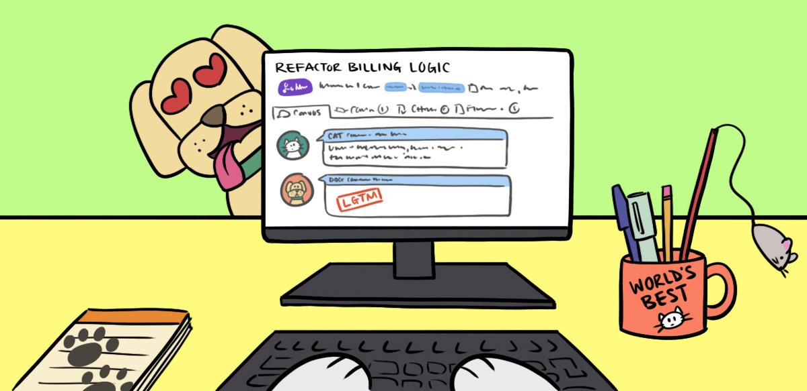

Когда люди говорят о код ревью (code review), они сосредотачиваются на том, кто его проводит. Но разработчик, который пишет код, также важен, как и тот человек, который его читает. Вряд ли есть какое-то руководство по подготовке кода к ревью, поэтому разработчики часто терпят неудачу в этом просто по незнанию.  

В этой статье описаны лучшие практики для участия в код ревью с точки зрения автора кода. На самом деле, к концу этой статьи вы можете стать настолько хороши в подготовке кода к ревью, что **ваш ревьювер буквально влюбится в вас**.

## Но я не хочу, чтобы мой ревьювер влюбился в меня

Они влюбятся в вас. Смиритесь с этим. Никто никогда не жаловался на смертном одре, что в него влюбилось слишком много людей.

## Зачем улучшать код ревью?

Улучшение техники код ревью помогает вашему ревьюверу, вашей команде и, самое главное, вам:

* **Учиться быстрее**: Если вы правильно подготовите свой список изменений (changelist, прим. перев. то же самое, что pull request или merge request) для код ревью, это направит внимание ревьювера на те области, которые способствуют вашему развитию, а не на скучные замечания о нарушении стиля. Если вы покажете вашу признательность за конструктивную критику, ваш ревьювер отправит вам более качественный отзыв.

* **Помогать другим становиться лучше**: Ваши приёмы для код ревью являются в том числе примером для ваших коллег. Эффективные практики в роли автора кода также передается вашим коллегам. Это облегчит и вашу работу, когда они будут присылать вам свой код.

* **Свести к минимуму конфликты в команде**: Код ревью - распространенный источник разногласий. Осознанный и добросовестный подход к ревью сводит споры к минимуму.

## Золотое правило: цените время вашего ревьювера

Этот совет звучит очевидно, но я часто вижу, как авторы кода относятся к своим ревьюверам как к персональным инженерам по качеству или тестировщикам. Такие авторы не прилагают никаких усилий, чтобы отловить свои собственные ошибки или подготовить свои изменения для удобного просмотра.

Ваши товарищи по команде каждый день приходят на работу с ограниченным запасом внимания и фокуса. Когда они выделяют часть его на вас, это значит, что они отнимают его от своей собственной работы. Будет справедливо, если вы максимально эффективно используете их время.

Также ревью значительно улучшается, когда оба участника доверяют друг другу. Ваш ревьювер приложит больше усилий, если он может рассчитывать, что вы отнесётесь к его комментариям серьёзно. Когда вы воспринимаете вашего ревьювера как препятствие, которое вы должны преодолеть, - это изначально ограничивает ценность того, что он вам может предложить.

## Приёмы

1. Проведите ревью своего кода сначала сами
2. Напишите чёткое описание для ваших изменений 
3. Автоматизируйте простые вещи
4. Отвечайте на вопросы самим кодом
5. Уменьшайте диапазон изменений
6. Разделяйте функциональные и нефункциональные изменения
7. Разбивайте большие списки изменений
8. Реагируйте на критику с благодарностью
9. Будьте терпеливы, когда ваш ревьювер не прав
10. Сообщайте ясно свои ответы
11. Запрашивайте умело недостающую информацию
12. Поощряйте все контакты с вашим ревьювером
13. Минимизируйте задержки между раундами код ревью

## 1. Проведите ревью своего кода сначала сами

Прежде чем отправлять код своему товарищу по команде, просмотрите его сами. Не просто проверьте ошибки, а представьте, что вы читаете код впервые. Что вас может в нём смутить?

Я считаю полезным делать перерыв между написанием кода и его ревью. Люди часто вносят изменения в конце дня, но именно в это время вы, скорее всего, пропустите ошибки по небрежности. Подождите до утра и посмотрите на свои изменения свежим взглядом, прежде чем передавать его товарищу по команде.

Старайтесь как можно лучше адаптироваться к обстановке, которая будет у вашего ревьювера. Используйте такой же вид для просмотра кода и сравнения файлов (diff), который будет применять ваш ревьювер. В режиме просмотра diff легче заметить глупые ошибки, чем в обычном редакторе исходников.

Не ждите от себя совершенства. Вы неизбежно отправите список изменений с отладочным кодом, который забыли удалить, или с лишним файлом, который хотели исключить. Эти ошибки - не конец света, но их стоит отслеживать. Обратите внимание на свои часто повторяемые ошибки и паттерны в них, и подумайте как системно можно их предотвратить. Если ошибки происходят слишком часто, это сигнализирует вашему ревьюверу, что вы не цените его время.

## 2. Напишите чёткое описание для ваших изменений

На моей последней работе я регулярно встречался со старшим инженером в рамках программы наставничества для разработчиков. Перед нашей первой встречей он попросил меня принести написанную мной архитектурную документацию. Вручив её ему, я объяснил, что это за проект, и как он согласуется с целями моей команды. Мой наставник нахмурился. "Всё, что вы мне сейчас рассказали, должно быть на первой странице вашего документа", - прямо сказал он.

Он был прав. Я писал свою документацию, представляя, как её будут читать мои товарищи по команде, но я не подумал о других читателях. Помимо моих непосредственных коллег по команде у меня была более широкая аудитория, включающая команды партнеров, наставников и [комитеты по продвижению](https://mtlynch.io/why-i-quit-google/).  Все они также должны были понимать всю документацию. После того разговора я всегда думаю о том, как оформить свою работу, чтобы объяснить её контекст.

В описании своих изменений следует кратко изложить все необходимые базовые знания. Возможно, вы уже пишете описание с мыслями о вашем ревьювере. Но важно помнить, что у него может быть совсем другой контекст, чем вы себе представляете. Кроме того, эти изменения могут понадобиться и другим участникам вашей команды. И также будущие разработчики должны понимать ваши намерения, когда будут возвращаться к истории изменений.

Хорошее описание объясняет на высокоуровневом языке, **что достигается** вашими изменениями, и **почему вы вносите** их.

Для более глубокого погружения в написание отличных описаний для списка изменений смотрите “Как написать описание для git commit” (англ. ["How to Write a Git Commit Message"](https://cbea.ms/git-commit/)) Криса Бимса и “Мой любимый git commit”(англ. ["My favourite Git commit"](https://dhwthompson.com/2019/my-favourite-git-commit)) Дэвида Томпсона.

## 3. Автоматизируйте простые вещи

Если вы ожидаете, что ваш ревьювер скажет вам, что ваши фигурные скобки находятся не на той строке, или что ваше изменение сломало автоматизированный набор тестов, то вы зря тратите его время.

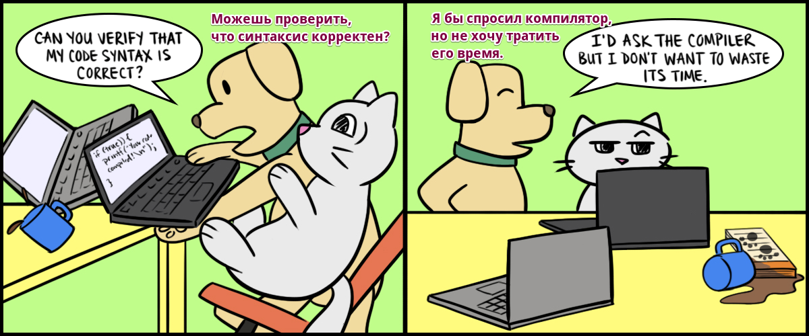

Автоматизированные тесты должны быть частью стандартного рабочего процесса вашей команды. Код ревью начинается после [прохождения всех автоматизированных проверок в среде непрерывной интеграции](https://mtlynch.io/human-code-reviews-1/#let-computers-do-the-boring-parts).

Если ваша команда сильно заблуждается и отказывается инвестировать в непрерывную интеграцию, автоматизируйте эти проверки самостоятельно. Добавьте в свою рабочую среду программы для форматирования и причёсывания кода (linters) и [git pre-commit hooks](https://www.atlassian.com/git/tutorials/git-hooks). Это поможет убедиться, что ваш код соблюдает нужные соглашения и стандарты кода, а также сохраняет нужное поведение при каждом коммите.

## 4. Отвечайте на вопросы самим кодом

Что не так с этой картинкой?

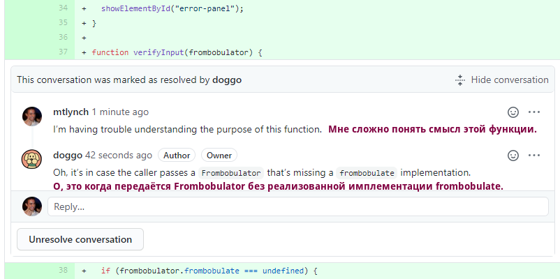

Автор помог мне понять эту функцию. Но как насчёт следующего человека, который её прочитает? Должен ли он погружаться в историю изменений и читать каждое обсуждение код ревью? Ещё хуже, когда автор подходит к моему столу, чтобы лично дать мне объяснение. Это и мешает мне сосредоточиться, и гарантирует, что никто другой никогда не получит доступ к этой информации.

Когда ваш ревьювер выражает недоумение по поводу того, как работает ваш код, ваше  решение должно быть не в том, чтобы объяснить это одному человеку. Вы должны объяснить это всем.

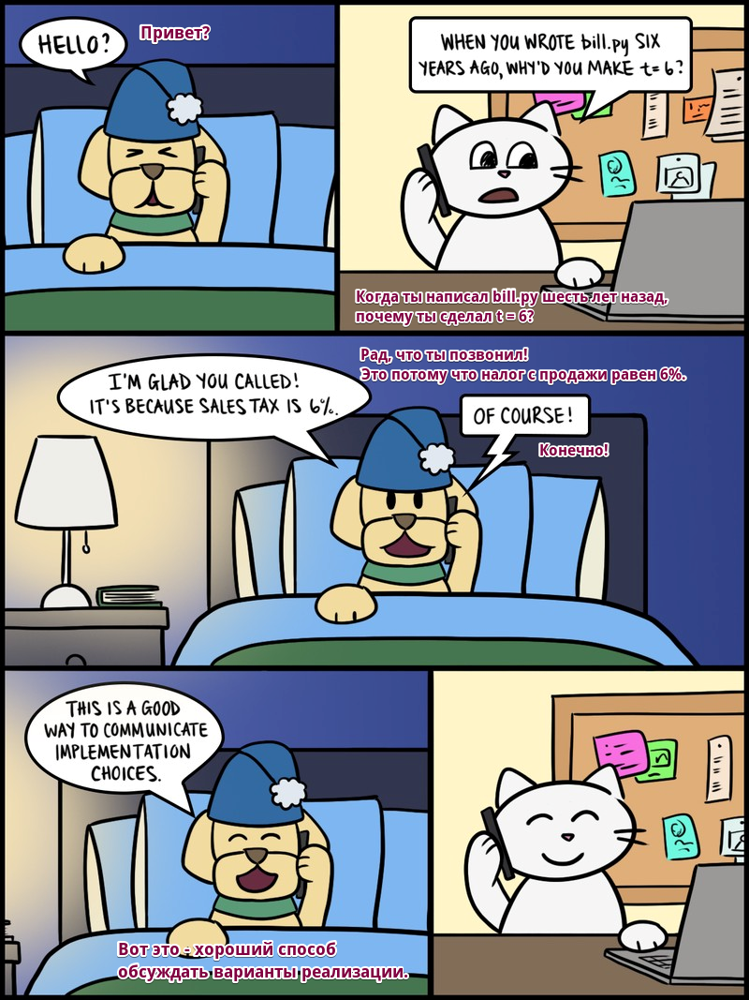

Лучший способ ответить на чей-то вопрос - это отрефакторить код и устранить путаницу. Можете ли вы переименовать вещи или перестроить логику, чтобы сделать её более понятной? Комментарии к коду могут быть приемлемым решением, но они сильно уступают понятному коду, который может сам по себе быть документацией.

## 5. Уменьшайте диапазон изменений

Расползание области видимости - распространенный антипаттерн при код ревью. Разработчик начинает исправлять логическую ошибку, но в процессе замечает недостатки пользовательского интерфейса. "Пока я здесь", - думает он,  - "я просто исправлю ещё одну вещь". Но теперь всё только запуталось. Ревьюверу приходится выяснять, какие изменения служат цели А, а какие - цели Б.

Лучшие списки изменений (changelist) просто [делают одно дело](https://blog.codinghorror.com/curlys-law-do-one-thing/). Чем меньше и проще изменение, тем легче ревьюверу удержать в голове весь контекст. Если вы разделите несвязанные изменения, это также позволит вам распараллелить эти ревью между разными участниками команды, что сократит время в целом на выполнение ваших изменений.

## 6. Разделяйте функциональные и нефункциональные изменения

Разделение функциональных и нефункциональных изменений будет также следствием уменьшения диапазона и контекста ваших изменений.

Разработчики, не имеющие опыта работы с код ревью, часто нарушают это правило. Они вносят изменения в две строки, а затем их редактор кода автоматически переформатирует весь файл. Разработчик либо не понимает, что он сделал, либо решает, что новое форматирование лучше. Он отправляет двухстрочное функциональное изменение, погребенное под сотнями строк нефункциональных изменений пробелов.

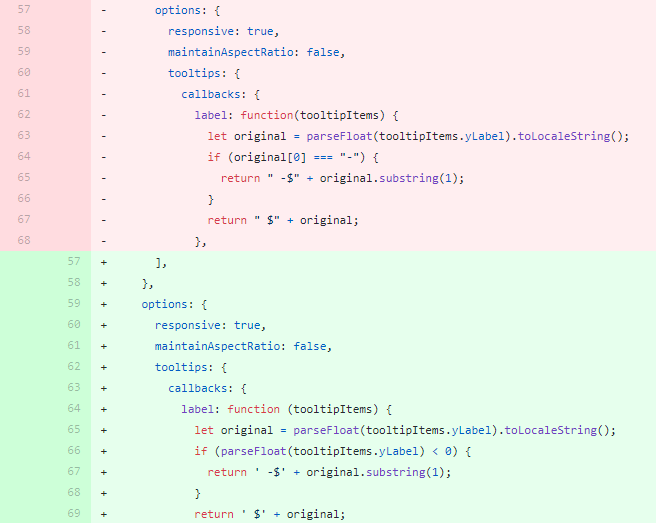

Можно ли заметить функциональное изменение, погребённое в шуме изменений пробелов?

Такие запутанные изменения звучат как огромное оскорбление для вашего ревьювера. Изменения только в пробелах легко просматривать. Изменения в две строки легко просматривать. Двухстрочные функциональные изменения, потерянные в море изменений пробелов, утомительны и безумны.

Разработчики также склонны к таким смешанным изменениям в процессе рефакторинга. Мне нравится, когда мои коллеги рефакторят код, но я ненавижу, когда они рефакторят, изменяя поведение кода.

Тут есть одно изменение в поведении, но изменения в результате рефакторинга скрывают его.

Если часть кода требует и рефакторинга, и изменения поведения, это должно произойти в двух-трёх разных изменениях (changelist):

1. Добавьте тесты для существующего поведения (если их ещё нет).
2. Отрефакторите работающий код, сохранив неизменным код тестов.
3. Измените поведение в коде и обновите тесты соответственно.

Оставляя автоматизированные тесты нетронутыми на этапе 2, вы ясно показываете своему ревьюверу, что ваш рефакторинг сохраняет поведение. Когда вы дойдете до шага 3, вашему ревьюверу не придется отделять изменения в поведении от рефакторинга, поскольку вы разделили их заранее.

## 7. Разбивайте большие списки изменений

Слишком большие списки изменений - это уродливые двоюродные братья "[расползания области видимости](https://mtlynch.io/code-review-love/#5-narrowly-scope-changes)". Предположим, разработчик обнаружил, что для внедрения функции X ему необходимы смысловые изменения в существующих библиотеках A и B. Если это небольшие изменения, то всё в порядке. Но слишком большое количество таких разрастающихся изменений может сделать список изменений огромным.

Сложность списка изменений растёт экспоненциально с количеством строк кода, которые он затрагивает. Когда мои изменения превышают 400 строк рабочего кода, я ищу возможности разбить его на части, прежде чем запрашивать ревью.

Вместо того чтобы менять всё сразу, можно ли сначала поменять зависимости, а добавить новую функциональность в последующем изменении? Можно ли сохранить код во вменяемом состоянии, если добавить половину функциональности сейчас, а другую половину - в следующем списке изменений?

Утомительно разбивать код на части, чтобы найти рабочее, понятное изменение, но это даёт лучшую обратную связь и снижает нагрузку на ревьювера.

## 8. Реагируйте на критику с благодарностью

Самый быстрый способ разрушить код ревью - начать принимать обратную связь на личный счёт. Это проблематичный момент, поскольку многие разработчики гордятся своей работой и считают её продолжением себя. Если ваш ревьювер к тому же бестактно оформит свои замечания [как личную атаку](https://mtlynch.io/human-code-reviews-1/#never-say-you), то ситуация станет ещё сложнее.
 
Как автор, [вы полностью можете контролировать вашу реакцию на комментарии](https://mtlynch.io/book-reports/7-habits-of-highly-effective-people/#habit-1-be-proactive). Относитесь к замечаниям ревьювера как к объективной дискуссии о коде, а не о вашей персональной значимости и ценности как человека. Защитная реакция только ухудшит ситуацию.

Я стараюсь воспринимать все замечания как полезные уроки. Когда ревьювер обнаруживает в моем коде досадную ошибку, мой первый инстинкт - начать оправдываться. Вместо этого я ловлю себя на этой мысли и хвалю ревьювера за его скрупулезность и внимательность.

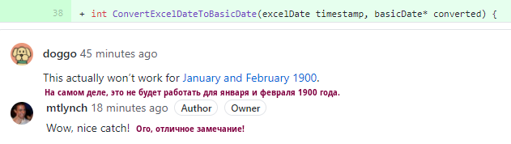

Выражайте благодарность, когда ваш ревьювер обнаруживает небольшую ошибку в вашем коде.

Как ни странно, но это **хороший** знак, когда ваш ревьювер обнаруживает небольшие недостатки в вашем коде. Это означает, что вы хорошо составляете списки изменений. Без таких очевидных проблем как неправильное форматирование и запутанные названия, ваш ревьювер может сфокусироваться на логике и проектировании, предоставляя вам более ценную обратную связь.

## 9. Будьте терпеливы, когда ваш ревьювер не прав

Время от времени ревьюверы откровенно ошибаются. Как вы можете случайно написать код неправильно, так и ваш ревьювер может неправильно понять правильный код.

Многие разработчики реагируют на ошибки ревьюверов очень оборонительно. Они воспринимают как серьёзное посягательство, когда кто-то оскорбляет их код своей критикой, которая _даже не соответствует действительности_.

Даже если ваш ревьювер ошибся, это всё равно должен быть для вас красный флажок. Если кто-то неправильно истолковал ваш код, сделают ли другие такую же ошибку? Должен ли читатель проявлять чрезвычайный уровень внимательности, чтобы убедиться, что _здесь нет определённой ошибки_?

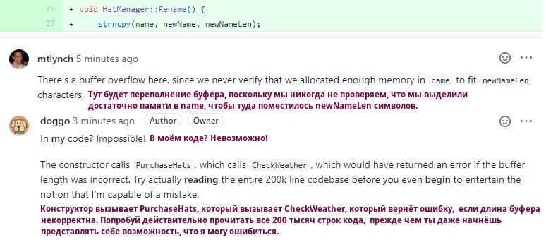

Не поддавайтесь искушению доказать неправоту вашего ревьювера, когда он ошибается.

Ищите способы рефакторинга кода или добавляйте комментарии, которые сделают код [более очевидным](https://wiki.c2.com/?TwoWaysToDesign). Если путаница возникает из-за непонятных особенностей языка, перепишите свой код, используя способы, понятные не только узким экспертам.

## 10. Сообщайте ясно свои ответы

Я часто сталкиваюсь с ситуацией, когда я делаю кому-то замечания, и коллеги обновляют свой код, чтобы учесть некоторые из моих замечаний, но не пишут при этом никаких ответов. Так мы попадаем в неоднозначное состояние. Пропустили ли они мои другие замечания, или они всё ещё над ними работают? Если я начну новый раунд ревью, то могу потенциально потратить время на полузаконченный список изменений. Если я буду ждать, то могу создать тупиковую ситуацию, когда мы оба сидим и ждём продолжения.

Установите в своей команде соглашения, которые позволяют чётко определить, кто "держит эстафету" в любой момент времени. Либо автор работает над правками, либо ревьювер смотрит код и пишет комментарии. Никогда не должно возникать ситуации, когда процесс застревает потому, что неизвестно, кто чем занимается. Этого можно легко добиться с помощью комментариев для списка изменений, которые указывают, когда вы передаете эстафету вперёд и назад.

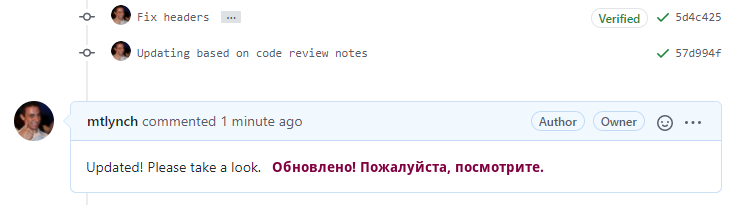

Прокомментируйте список изменений, чтобы явно сообщить, когда вы передаёте эстафету обратно своему ревьюверу.

На каждое замечание, требующее действий, отвечайте явным образом, чтобы подтвердить, что вы его устранили. Некоторые инструменты рецензирования кода позволяют отмечать комментарии как решённые. Если это не ваш случай, следуйте простому соглашению, например, используйте слово "Готово" для каждого замечания. Если вы не согласны с замечанием, вежливо объясните, почему вы отказались от исправлений.

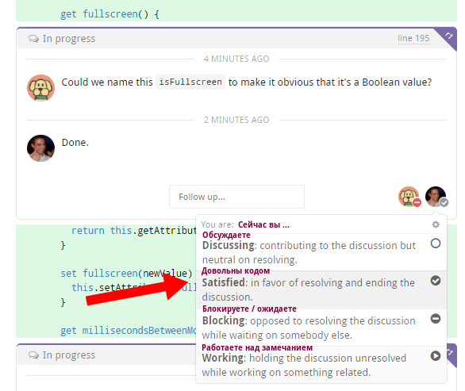

Такие инструменты как [Reviewable](https://reviewable.io/) и [Gerritt](https://www.gerritcodereview.com/), предлагают механизмы, позволяющие автору отмечать конкретные замечания как решённые.

Корректируйте свой ответ в зависимости от усилий ревьювера. Если вам написали подробное замечание, которое помогло вам узнать что-то новое, не просто пометьте его как выполненное. Ответьте вдумчиво, чтобы выразить благодарность за усилия вашего ревьювера.

## 11. Запрашивайте умело недостающую информацию

Иногда замечания к коду оставляют слишком много возможностей для интерпретации. Когда вы получаете комментарий типа: "Эта функция запутанная", вы, вероятно, задаётесь вопросом, что именно означает "запутанная". Функция слишком длинная? Или название неясное? Требуется ли для неё дополнительная документация?

Долгое время я пытался прояснять двусмысленные замечания, стараясь не занимать оборонительную позицию. Инстинкт подсказывал мне спрашивать: "Что в этом непонятного?", но это выглядело ворчливо.

Однажды я случайно отправил неясные замечания своему товарищу по команде, и он ответил, на мой взгляд, фантастически обезоруживающе:

> _Какие изменения были бы полезны?_

Я обожаю такой ответ, потому что он свидетельствует об открытости к критике и об отсутствии оборонительной позиции. Всякий раз, когда ревьювер даёт мне неясную обратную связь, я всегда отвечаю различными вариациями вопроса "А что было бы полезно?".

Еще один полезный приём - попробовать угадать намерения ревьювера и проактивно отредактировать свой код в соответствии с этим предположением. В случае замечания типа: "Это сбивает с толку", посмотрите на свой код ещё раз. Обычно есть что-то, что можно сделать для улучшения ясности кода. Это даёт понять вашему ревьюверу, что вы готовы к изменениям, даже если это не совсем то, что имелось в виду.

## 12. Поощряйте все контакты с вашим ревьювером

В теннисе, когда вы не уверены в том, что подача вашего соперника попала за пределы поля, вы предоставляете ему кредит доверия. Аналогичные ожидания должны быть и в отношении код ревью.

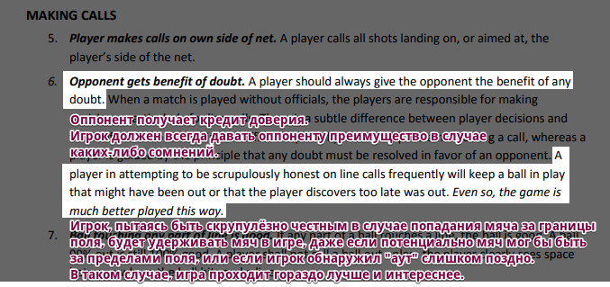

Ассоциация тенниса США требует, чтобы [игроки давали своим соперникам кредит доверия при попадании мяча на границы поля](https://www.usta.com/content/dam/usta/pdfs/2015_Code.pdf).

Некоторые решения в коде - это вопрос личного вкуса. Если ваш ревьювер считает, что ваша 8-строчная функция была бы лучше в виде двух 5-строчных функций, никого из вас объективно нельзя назвать "правым". Это будет вопрос личного мнения, какая версия лучше.

Когда ревьювер вносит предложение, и у каждого из вас есть примерно равные доказательства в поддержку своей позиции, доверьтесь ревьюверу. Среди вас двоих у него лучшее представление о том, как читать этот код свежим взглядом.

## 13. Минимизируйте задержки между раундами код ревью

Несколько месяцев назад один из пользователей внёс небольшое изменение в проект с открытым кодом, который я поддерживаю. Я дал обратную связь в течение нескольких часов, но разработчик быстро исчез. Я перепроверил через несколько дней, но ответа по-прежнему не было.

Шесть недель спустя таинственный разработчик снова появился, чтобы предложить свои изменения. Хотя я оценил его усилия, задержка между раундами код ревью удвоила мою нагрузку. Мне пришлось не только перечитывать заново код, но и перечитывать свои комментарии, чтобы восстановить в памяти ход обсуждения. Если бы он откликнулся в течение дня или двух, мне не пришлось бы делать всю эту дополнительную работу.

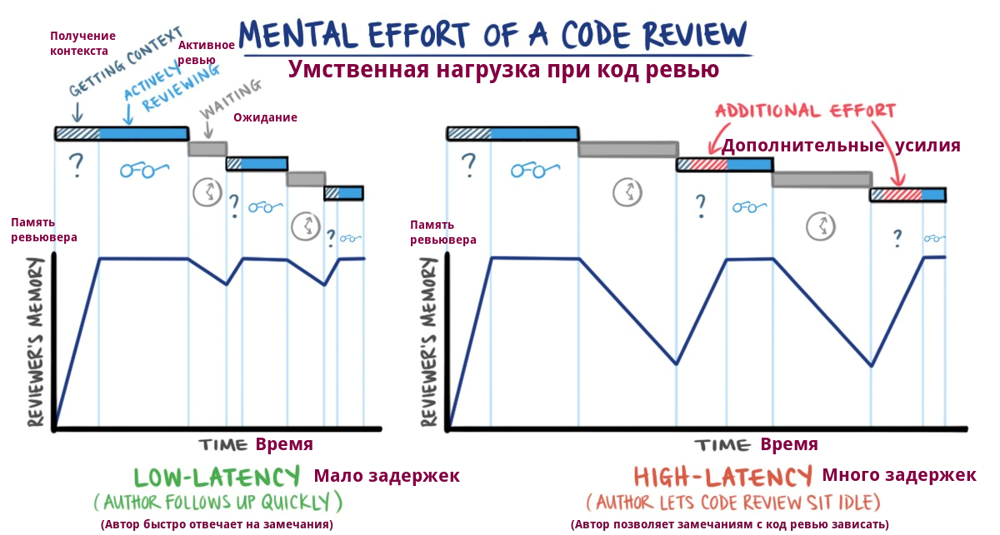

Шести-недельная пауза - это, конечно, крайность. Но я часто вижу длительные, ненужные задержки при работе в команде. Кто-то отправляет свои изменения на ревью, получает комментарии, а затем откладывает их на неделю, потому что его отвлекла другая задача.

Помимо потери времени на восстановление контекста, полузаконченные списки изменений увеличивают сложность в работе. Становится сложнее отследить, что уже залито (merged), а что пока в процессе работы. При большем количестве частично завершённых изменений возникает больше конфликтов при слиянии кода (merge conflicts), а исправлять конфликты никому не нравится.

Как только вы отправили свой код на ревью, вашим главным приоритетом должно стать доведение ревью до успешного финала. Задержки с вашей стороны приводят к потере лишнего времени у ревьювера, а также увеличивают сложность для всей команды.

## Заключение

Когда вы будете готовить свои следующие изменения для код ревью, подумайте о факторах в пределах вашего контроля, и поработайте с ними, чтобы ревью прошло продуктивно. Участвуя в ревью, ищите свои паттерны, которые тормозят прогресс или приводят к напрасной трате сил и времени у вас и у вашего ревьювера.

Помните золотое правило: цените время вашего ревьювера. Ревьювер сможет прислать вам высококачественную обратную связь, когда вы позволите ему сосредоточиться на интересных частях вашего кода. Если вы требуете, чтобы ваш ревьювер распутывал ваш код или исправлял простые ошибки, то вы оба пострадаете.

Наконец, общайтесь вдумчиво. Пугающе легко испортить ревью из-за простого недопонимания или необдуманных комментариев. Эмоции накаляются, когда критикуют чью-то работу, поэтому помните о подводных камнях и словах, из-за которых ваш ревьювер может почувствовать себя оскорбленным или неуважаемым.

Поздравляем! Если вы дошли до этого момента, то вы уже эксперт в области ревью. Ваш ревьювер, скорее всего, влюблен в вас, поэтому относитесь к нему хорошо.

**Переведено:** [Светлана Кривенко](https://fb.com/sveta.krivenko.7) 
