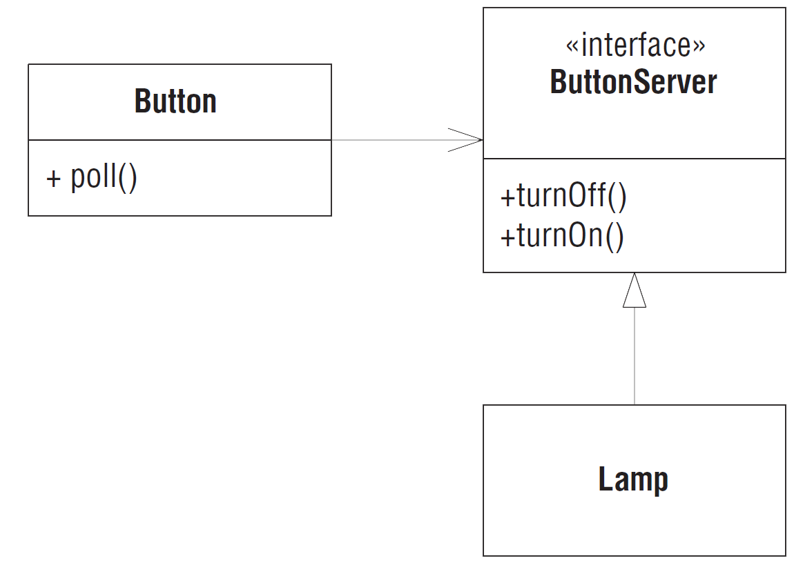

# Принцип инверсии зависимостей (DIP)

Оригинальный текст из книги Робертом Мартина [Agile Principles, Patterns, and Practices](https://www.amazon.com/Agile-Principles-Patterns-Practices-C/dp/0131857258).

---
**Принцип инверсии зависимости (Dependency-Inversion Principle – DIP)**

*A. Модули верхнего уровня не должны зависеть от модулей нижнего уровня. И те и другие должны зависеть от абстракций.*
*B. Абстракции не должны зависеть от деталей. Детали должны зависеть от абстракций.*

---

Многие люди интересуются, почему в названии этого принципа присутствует слово "инверсия". А причина в том, что в традиционных методологиях разработки, например в структурном анализе и проектировании, принято создавать программные конструкции, в которых модули верхнего уровня зависят от модулей нижнего уровня, а стратегия – от деталей. Собственно, одна из целей таких методологий состоит в том, чтобы определить иерархию подпрограмм, описывающую, как модули верхнего уровня обращаются к модулям нижнего уровня. Но в правильно спроектированной объектно-ориентированной программе структура зависимостей "инвертирована" по отношению к той, что возникает в результате применения традиционных процедурных методик.

Посмотрим, к чему приводит зависимость модулей верхнего уровня от модулей нижнего уровня. Именно в модулях верхнего уровня инкапсулированы важные стратегические решения и бизнес-модели приложения. Эти модули и отличают одно приложение от другого. Но если они зависят от модулей нижнего уровня, то изменение последних может напрямую отразиться на модулях верхнего уровня и стать причиной их изменения. Например, чтобы изменить правила проверки при одобрении кредита, приходится менять ещё и UI, отражающий результат проверки, и модуль печати, который генерирует печатные формы.

Но ведь такое положение вещей – нелепость! Это модули верхнего уровня, определяющие стратегию, должны влиять на модули нижнего уровня, а не наоборот. Модули, которые содержат высокоуровневые бизнес-правила, должны быть приоритетнее модулей, определяющих детали реализации, и независимы от них. Модули верхнего уровня вообще никак не должны зависеть от модулей более низкого уровня.  

Именно модули верхнего уровня, определяющие стратегию, мы и хотели бы использовать повторно. Мы уже поднаторели в повторном использовании низкоуровневых модулей, представленных в виде библиотек подпрограмм. Но если модули верхнего уровня зависят от модулей нижнего уровня, то повторно использовать первые в различных контекстах становится трудно. Если же такой зависимости нет, то повторное использование модулей верхнего уровня существенно упрощается. Этот принцип лежит в основе проектирования всех каркасов.

## Пример DIP

Инверсию зависимости можно применять всякий раз, как один класс посылает сообщение другому. Рассмотрим, например, объекты ```Button``` (Кнопка) и ```Lamp``` (Лампа).

Объект ```Button``` реагирует на внешние воздействия. Получив сообщение ```Poll```, объект Button определяет, «нажал» ли пользователь на кнопку. Механизм определения не имеет значения. Это может быть кнопка в графическом интерфейсе пользователя, физическая кнопка, которую человек нажимает пальцем, или даже детектор движения в системе охраны жилища. Объект ```Button``` умеет распознавать, что сделал пользователь: активировал или деактивировал его.

Как спроектировать систему, в которой объект ```Button``` управляет объектом ```Lamp```? Объект ```Button``` получает сообщения ```poll```, определяет, была ли нажата кнопка, а затем посылает сообщение ```turnOn``` или ```turnOff``` объекту ```Lamp```.


*Наивная модель объектов Button и Lamp*

Почему наивная? Рассмотрим код на Java, вытекающий из этой модели. Отметим, что класс ```Button``` напрямую зависит от класса ```Lamp```. Наличие такой зависимости означает, что Button восприимчив к изменениям в ```Lamp```. И значит, повторно использовать ```Button``` для управления, скажем, объектом Motor не получится. В этой модели объекты Button управляют объектами ```Lamp``` и только ```Lamp```.

```java
public class Button
{
    private Lamp lamp;
    
    public void poll()
    {
        if (/* какое-то условие */)
            lamp.turnOn();
    }
}

public class Lamp {

    public void turnOn() {
        /* ... */
    }

    public void turnOff() {
        /* ... */
    }
}
```

Это решение нарушает принцип DIP. Высокоуровневая стратегия приложения не отделена от низкоуровневой реализации. Абстракции не отделены от деталей. В отсутствие такого разделения стратегия верхнего уровня автоматически зависит от модулей нижнего уровня, а абстракции автоматически зависят от деталей.

Что такое стратегия верхнего уровня? Это абстракция, лежащая в основе приложения, та суть, которая не изменяется при изменении деталей.
Это система *внутри* системы – метафора. В примере ```Button```/```Lamp``` глубинная абстракция состоит в том, чтобы распознать действие пользователя включить/выключить и сообщить о нем конечному объекту. Какой механизм применяется для распознавания действия пользователя? Несущественно! Какой объект конечный? Неважно! Все это детали, не играющие для абстракции никакой роли.

Нашу модель можно улучшить, инвертировав зависимость от объекта ```Lamp```. На рисунке ниже мы видим, что ```Button``` теперь хранит ассоциацию с неким объектом ```ButtonServer```, который предоставляет интерфейс, позволяющий Button включить или выключить нечто. Класс ```Lamp``` реализует интерфейс ```ButtonServer```. Следовательно, теперь не мы зависим от объекта ```Lamp```, а он сам является зависимым.



*Инверсия зависимости в применении к Lamp*

```java
public class Button {
    
    private ButtonServer buttonServer;

    public void poll() {
        if (/* какое-то условие */)
            buttonServer.turnOn();
    }
}

public interface ButtonServer {
    
    void turnOn();

    void turnOff();
}

public class Lamp implements ButtonServer {

    @Override
    public void turnOn() {
        /* ... */
    }

    @Override
    public void turnOff() {
        /* ... */
    }
}
```

Такой дизайн позволяет ```Button``` управлять любым устройством, готовым реализовать интерфейс ```ButtonServer```. Это обеспечивает высокую гибкость, а также означает, что объекты Button смогут управлять еще не изобретенными объектами.

Однако же это решение налагает ограничение на объект, управляемый ```Button```. Такой объект обязан реализовать интерфейс ```ButtonServer```. Это печально, потому что такие объекты, возможно, захотят управляться также объектом ```Switch``` или еще каким-то, помимо ```Button```.

Инвертировав направление зависимости и сделав объект ```Lamp``` зависящим, мы заставили ```Lamp``` зависеть от другой детали: Button. А так ли это?

Очевидно, что ```Lamp``` зависит от ```ButtonServer```, но ```ButtonServer``` не зависит от ```Button```. Любой объект, знающий, как работать с интерфейсом ButtonServer, сможет управлять объектом Lamp. Следовательно, на самом деле мы зависим только от имени. И можем исправить это, переименовав ```ButtonServer``` в нечто более общее, скажем, ```SwitchableDevice```. Мы можем также поместить ```Button``` и ```SwitchableDevice``` в разные библиотеки, чтобы использование ```SwitchableDevice``` не подразумевало использование ```Button```.

В таком случае у этого интерфейса нет владельца. Мы получаем любопытную ситуацию, когда интерфейс может использоваться разными клиентами и реализовываться разными серверами. Стало быть, интерфейс должен существовать сам по себе, не примыкая ни к какой группе. В Java это достигается помещением его в отдельный пакет и в отдельную библиотеку. В динамических языках типа Smalltalk, Python или Ruby этот интерфейс
вообще не существовал бы в виде явно написанного кода.

В традиционном процедурном программировании структура зависимостей такова, что стратегия зависит от деталей. Это плачевно, потому что стратегия становится восприимчивой к изменению деталей. В объектно-ориентированном программировании структура зависимостей инвертируется, так что и детали, и стратегии зависят от абстракции, а интерфейсами служб часто владеют клиенты.

На самом деле такая инверсия зависимостей – отличительный признак объектно-ориентированного дизайна. Неважно, на каком языке написана программа. Если зависимости инвертированы, значит, мы имеем объектно-ориентированный дизайн. В противном случае дизайн процедурный.

Принцип инверсии зависимостей – это фундаментальный низкоуровневый механизм, лежащий в основе многих преимуществ, которые обещают объектно-ориентированные технологии. Его надлежащее применение необходимо для создания повторно используемых каркасов. Кроме того, он крайне важен для конструирования кода, устойчивого к изменениям. Поскольку абстракции и детали изолированы друг от друга, такой код гораздо легче сопровождать.

Адаптировал: [Кротов Артём](https://fb.com/artem.v.krotov).

Остались вопросы? Задавай в [нашем чате](https://t.me/technicalexcellenceru).
