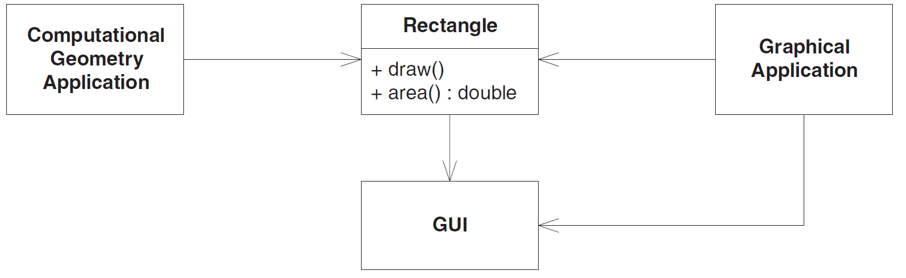

# Принцип разделения интерфейсов (ISP) [draft]

Оригинальный текст из книги Робертом Мартина [Agile Principles, Patterns, and Practices](https://www.amazon.com/Agile-Principles-Patterns-Practices-C/dp/0131857258).

Этот принцип относится к недостаткам "жирных" интерфейсов. Говорят, что класс имеет «жирный» интерфейс, если функции этого интерфейса недостаточно сцепленные. Иными словами, интерфейс класса можно разбить на группы методов. Каждая группа предназначена для обслуживания разнотипных клиентов. Одним клиентам нужна одна группа методов, другим – другая.

---
**Принцип разделения интерфейсов (Interface Segregation Principle - ISP)**

*Клиенты не должны вынужденно зависеть от методов, которыми не пользуются.*

--

Принцип ISP допускает, что могут существовать объекты, нуждающиеся в несцепленных интерфейсах, однако предполагает, что клиентам необязательно знать, что это единый класс. Клиенты должны лишь знать об абстрактных интерфейсах, обладающих свойством сцепленности.

## Пример DIP

Рассмотрим охранную систему, в которой объекты ```Door``` (Дверь) можно запирать и отпирать, а также узнавать, открыта дверь или закрыта. Тип ```Door``` закодирован в виде интерфейса, чтобы клиенты могли использовать объекты, согласованные с интерфейсом двери, не зная о деталях конкретной реализации.

```java
public interface Door {
    void lock();
    
    void unlock();
    
    boolean isOpen();
}
```

Теперь предположим, что одна такая реализация, ```TimedDoor```, должна подавать звуковой сигнал, если дверь остается открытой слишком долго. Для этого ```TimedDoor``` взаимодействует с объектом ```Timer```.

```java
public class Timer {

public void register(int timeout, TimerClient client) {
    /* ... */
}

public interface TimerClient {
    
    void timeOut();
    
}
```

Если объект желает получать уведомление об истечении тайм-аута, он вызывает метод ```register``` объекта ```Timer```. Этому методу в качестве аргументов передаются величина тайм-аута и ссылка на объект ```TimerClient```, метод ```timeOut``` которого нужно вызвать, когда тайм-аут истечет.

Как организовать взаимодействие класса ```TimerClient``` с классом ```TimedDoor``` таким образом, чтобы некий код внутри ```TimedDoor``` мог получать уведомления о тайм-ауте? Есть несколько вариантов. На рисунке ниже показано наиболее распространённое решение. Мы производим класс ```Door```, а значит, и ```TimedDoor``` от ```TimerClient```. Тем самым гарантируется, что TimerClient может зарегистрировать себя в объекте ```Timer``` и получить сообщение ```TimeOut```.



*Класс TimerClient на вершине иерархии*

Проблема этого решения в том, что класс ```Door``` теперь зависит от ```TimerClient```. Но не всем разновидностям ```Door``` необходимо следить за временем. На самом деле первоначальная абстракция ```Door``` вообще ничего не знала об отсчете времени. При создании производных от ```Door``` классов, не интересующихся временем, нам придется включать вырожденные реализации метода ```timeOut```, то есть идти на нарушение принципа LSP. К тому же приложения, в которых используются такие производные классы, должны будут импортировать определение класса ```TimerClient```, хотя оно им и не нужно. Это попахивает ненужной сложностью и ненужным повторением.

Это пример загрязнения интерфейса – синдрома, характерного для таких статически типизированных языков, как C#, C++ и Java. Интерфейс ```Door``` загрязнен лишним методом, который включен исключительно для нужд подклассов. Если следовать такой практике, то всякий раз, как производному классу понадобится новый метод, мы должны будем добавлять его в базовый класс. От этого интерфейс базового класса загрязнится еще больше и станет "жирным".

Хуже того, при добавлении в базовый класс каждого нового метода его придется реализовывать в производных классах. На практике методы базового класса снабжают некоей вырожденной реализацией по умолчанию, чтобы не обременять клиентов их реализацией. Но, как мы выяснили ранее, такая практика нарушает принцип LSP и ведет к проблемам с сопровождением и повторным использованием.

"Жирные" классы приводят к неочевидным и вредным связям между их клиентами. Если одному клиенту требуется изменить жирный класс, то оказываются затронуты и все остальные классы. Поэтому клиенты должны зависеть только от методов, которые вызывают. Этого можно достичь путем разбиения интерфейса жирного класса на несколько интерфейсов, специально предназначенных для клиентов. В каждом таком интерфейсе объявляются только методы, которые вызывает конкретный клиент или группа клиентов. Затем жирный класс может унаследовать всем специальным для клиентов интерфейсам и реализовать их. Это разрывает зависимость клиента от методов, к которым он не обращается, и делает клиентов независимыми друг от друга.

Адаптировал: [Кротов Артём](https://fb.com/artem.v.krotov).

Остались вопросы? Задавай в [нашем чате](https://t.me/technicalexcellenceru).
