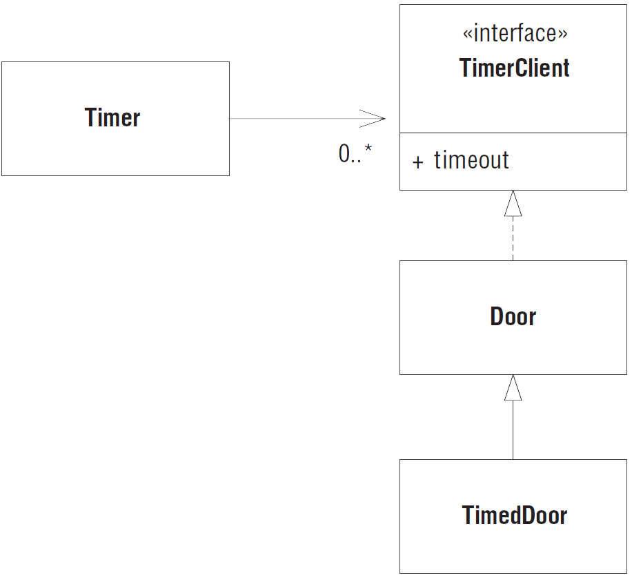
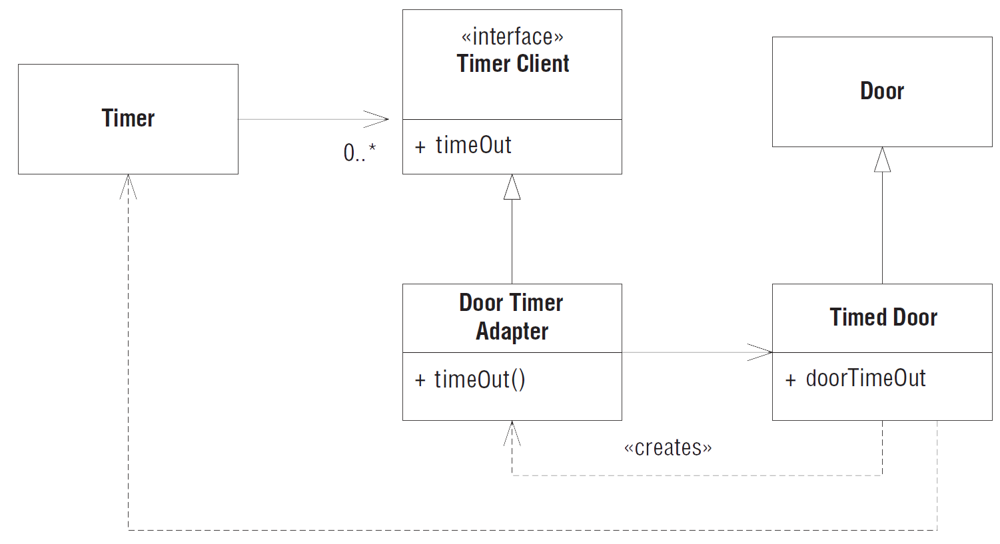
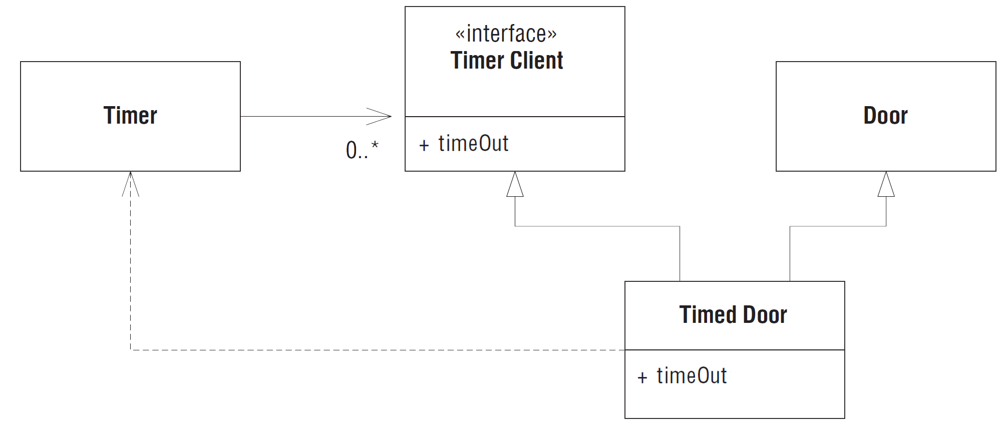

# Принцип разделения интерфейсов (ISP)

Оригинальный текст из книги Робертом Мартина [Agile Principles, Patterns, and Practices](https://www.amazon.com/Agile-Principles-Patterns-Practices-C/dp/0131857258).

Этот принцип относится к недостаткам "жирных" интерфейсов. Говорят, что класс имеет «жирный» интерфейс, если функции этого интерфейса недостаточно сцепленные. Иными словами, интерфейс класса можно разбить на группы методов. Каждая группа предназначена для обслуживания разнотипных клиентов. Одним клиентам нужна одна группа методов, другим – другая.

---
**Принцип разделения интерфейсов (Interface Segregation Principle - ISP)**

*Клиенты не должны вынужденно зависеть от методов, которыми не пользуются.*

--

Принцип ISP допускает, что могут существовать объекты, нуждающиеся в несцепленных интерфейсах, однако предполагает, что клиентам необязательно знать, что это единый класс. Клиенты должны лишь знать об абстрактных интерфейсах, обладающих свойством сцепленности.

## Пример DIP

Рассмотрим охранную систему, в которой объекты ```Door``` (Дверь) можно запирать и отпирать, а также узнавать, открыта дверь или закрыта. Тип ```Door``` закодирован в виде интерфейса, чтобы клиенты могли использовать объекты, согласованные с интерфейсом двери, не зная о деталях конкретной реализации.

```java
public interface Door {
    void lock();
    
    void unlock();
    
    boolean isOpen();
}
```

Теперь предположим, что одна такая реализация, ```TimedDoor```, должна подавать звуковой сигнал, если дверь остается открытой слишком долго. Для этого ```TimedDoor``` взаимодействует с объектом ```Timer```.

```java
public class```Timer``` {

public void register(int timeout,```Timer```Client client) {
    /* ... */
}

public interface```Timer```Client {
    
    void timeOut();
    
}
```

Если объект желает получать уведомление об истечении тайм-аута, он вызывает метод ```register``` объекта ```Timer```. Этому методу в качестве аргументов передаются величина тайм-аута и ссылка на объект ```TimerClient```, метод ```timeOut``` которого нужно вызвать, когда тайм-аут истечет.

Как организовать взаимодействие класса ```TimerClient``` с классом ```TimedDoor``` таким образом, чтобы некий код внутри ```TimedDoor``` мог получать уведомления о тайм-ауте? Есть несколько вариантов. На рисунке ниже показано наиболее распространённое решение. Мы производим класс ```Door```, а значит, и ```TimedDoor``` от ```TimerClient```. Тем самым гарантируется, что```Timer```Client может зарегистрировать себя в объекте ```Timer``` и получить сообщение ```TimeOut```.



*Класс TimerClient на вершине иерархии*

Проблема этого решения в том, что класс ```Door``` теперь зависит от ```TimerClient```. Но не всем разновидностям ```Door``` необходимо следить за временем. На самом деле первоначальная абстракция ```Door``` вообще ничего не знала об отсчете времени. При создании производных от ```Door``` классов, не интересующихся временем, нам придется включать вырожденные реализации метода ```timeOut```, то есть идти на нарушение принципа LSP. К тому же приложения, в которых используются такие производные классы, должны будут импортировать определение класса ```TimerClient```, хотя оно им и не нужно. Это попахивает ненужной сложностью и ненужным повторением.

Это пример загрязнения интерфейса – синдрома, характерного для таких статически типизированных языков, как C#, C++ и Java. Интерфейс ```Door``` загрязнен лишним методом, который включен исключительно для нужд подклассов. Если следовать такой практике, то всякий раз, как производному классу понадобится новый метод, мы должны будем добавлять его в базовый класс. От этого интерфейс базового класса загрязнится еще больше и станет "жирным".

Хуже того, при добавлении в базовый класс каждого нового метода его придется реализовывать в производных классах. На практике методы базового класса снабжают некоей вырожденной реализацией по умолчанию, чтобы не обременять клиентов их реализацией. Но, как мы выяснили ранее, такая практика нарушает принцип LSP и ведет к проблемам с сопровождением и повторным использованием.

Типы ```Door``` и ```TimerClient``` представляют интерфейсы, используемые совершенно разными клиентами. Класс ```Timer``` использует ```TimerClient```, а классы, манипулирующие дверьми - ```Door```. Поскольку эти клиенты разделены, то должны быть разделены и интерфейсы. Почему? Потому, что клиент определяет интерфейс своего сервера.

Размышляя о необходимости изменения в программах, мы обычно думаем, как изменение интерфейса отразится на его пользователях. Например, мы задались бы вопросом о том, какие изменения придется произвести в коде пользователей ```TimerClient```, если его интерфейс изменится. Однако существует сила, действующая в другом направлении. Иногда изменение интерфейса вызвано желанием *пользователя*.

Например, некоторые клиенты класса ```Timer``` хотели бы регистрировать более одного запроса на истечение тайм-аута. Рассмотрим класс ```TimerDoor```. Обнаружив, что дверь открыта, он посылает сообщение ```register``` классу ```Timer```, запрашивая уведомление о тайм-ауте. Однако еще до истечения тайм-аута дверь закрывается, остается некоторое время закрытой, а потом открывается снова. Это заставляет нас зарегистрировать новый запрос уведомления о тайм-ауте еще до того, как истёк предыдущий. Но в конечном итоге первый тайм-аут истекает и вызывается метод ```timeOut``` класса ```TimerDoor```. Класс ```Door``` подаёт ложную тревогу.

Эту ситуацию можно исправить, как будет показано ниже. Мы включаем в каждый запрос о регистрации тайм-аута уникальный код ```timeOutId``` и передаем этот код при вызове метода ```timeOut```. В результате объект любого класса, производного от ```TimerClient```, знает, на какой запрос об истечении тайм-аута он отвечает.

```java
public class Timer {
 
    public void register(int timeout, int timeOutId, TimerClient client) {
        /* код */
    }
}

public interface TimerClient {
    
    void timeOut(int timeOutId);

}
```

Понятно, что такое изменение отразится на всех пользователях интерфейса ```TimerClient```. Мы готовы на это пойти, потому что отсутствие параметра ```timeOutId``` – упущение, которое нужно исправить. Однако представленный на первом рисунке дизайн влечет за собой необходимость изменить также интерфейс ```Door``` и всех его клиентов! А это уже попахивает жесткостью и вязкостью. С какой стати ошибка в ```TimerClient``` должна хоть каким-то образом влиять на клиентов классов, производных от ```Door```, которым вовсе не требуется следить за временем? Это странная взаимозависимость сильно пугает заказчиков и менеджеров. Если изменение в одной части программы оказывает влияние на другие, совершенно с ней не связанные, то стоимость сопровождения становится непредсказуемой, а риск нежелательных последствий изменения резко возрастает.

Если клиент вынужденно зависит от методов, которыми не пользуется, то он оказывается восприимчив к изменениям в этих методах. В результате возникает непреднамеренная связанность между всеми клиентами. Иначе говоря, если клиент зависит от класса, содержащего методы, которыми этот клиент не пользуется, но пользуются другие клиенты, то данный клиент становится зависим от всех изменений, вносимых в класс в связи с потребностями этих "других клиентов". Мы хотели бы по возможности избежать таких связей и потому стремимся разделять интерфейсы.

Одно решение состоит в том, чтобы создать класс, который наследует ```TimerClient``` и делегирует часть своих обязанностей ```TimerDoor```. Оно показано на рисунке ниже. Когда объект хочет зарегистрировать запрос на уведомление о тайм-ауте в объекте Timer, ```TimerDoor``` создает экземпляр ```DoorTimerAdapter``` и регистрирует его в Timer. Когда Timer посылает сообщение ```TimeOut``` объекту ```DoorTimerAdapter```, тот передает его объекту ```TimerDoor```.



*Адаптер таймера двери*

Это решение согласуется с принципом ISP и не создает связей между клиентами ```Door``` и классом ```Timer```. Даже если в класс Timer придется внести изменение, но ни один из пользователей Door не пострадает. Более того, класс ```TimedDoor``` даже не обязан иметь в точности такой же интерфейс, как ```TimerClient```. Класс ```DoorTimerAdapter``` может преобразовать интерфейс ```TimerClient``` в интерфейс ```TimedDoor```. Поэтому такое решение обладает большой универсальностью.

```java
public interface TimedDoor extends Door {

    void doorTimeOut(int timeOutId);

}

public class DoorTimerAdapter implements TimerClient  {
    
    private TimedDoor timedDoor;

    public DoorTimerAdapter(TimedDoor theDoor) {
        timedDoor = theDoor;
    }
    
    public void timeOut(int timeOutId) {
        timedDoor.doorTimeOut(timeOutId);
    }
}
```

Однако оно не слишком элегантно. Каждый раз, когда мы хотим зарегистрировать тайм-аут, приходится создавать новый объект. И делегирование требует пусть и небольшого, но ненулевого времени и памяти. В некоторых категориях приложений, например во встроенных системах управления реального времени, процессорное время и память – настолько дефицитные ресурсы, что этим недостатком пренебречь нельзя.

На рисунке и в листинге ниже показано, как можно поддержать принцип ISP с помощью множественного наследования. В этой модели класс ```TimedDoor``` наследует одновременно ```Door``` и ```TimerClient```. Хотя клиенты обоих базовых классов могут пользоваться объектом TimedDoor, ни один из них от класса ```TimedDoor``` не зависит. То есть они пользуются одним и тем же объектом через раздельные интерфейсы.

```java
public interface TimedDoor extends Door, TimerClient  {

}
```



*Класс TimedDoor с множественным наследованием*

"Жирные" классы приводят к неочевидным и вредным связям между их клиентами. Если одному клиенту требуется изменить жирный класс, то оказываются затронуты и все остальные классы. Поэтому клиенты должны зависеть только от методов, которые вызывают. Этого можно достичь путем разбиения интерфейса жирного класса на несколько интерфейсов, специально предназначенных для клиентов. В каждом таком интерфейсе объявляются только методы, которые вызывает конкретный клиент или группа клиентов. Затем жирный класс может унаследовать всем специальным для клиентов интерфейсам и реализовать их. Это разрывает зависимость клиента от методов, к которым он не обращается, и делает клиентов независимыми друг от друга.

Адаптировал: [Кротов Артём](https://fb.com/artem.v.krotov).

Остались вопросы? Задавай в [нашем чате](https://t.me/technicalexcellenceru).
