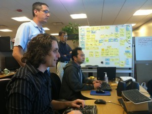
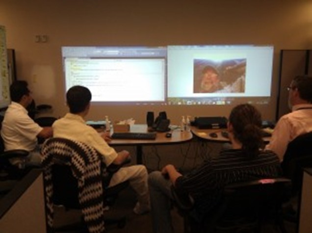

# Моб-программирование — командный подход к работе

**Оригинал:** https://www.agilealliance.org/resources/experience-reports/mob-programming-agile2014/

**Об авторе:** [Вуди Зил](https://www.agilealliance.org/author/5052028) (Woody Zuill) — независимый Agile гид и коуч, он также занимается программированием более 35 лет. Он является пионером в моб-программировании и одним из инициаторов дискуссии «#NoEstimates» в Twitter.

«Давайте найдём способ сделать так, чтобы каждый из нас мог преуспеть в своей работе и жизни».

**1. Введение**

**Моб-программирование** — это подход к разработке программного обеспечения, при котором вся команда целиком работает над одним и тем же, в одно и то же время и в одном и том же месте за одним компьютером. Это похоже на **парное программирование [PAIR]**, где двое человек сидят за одним компьютером и совместно работают над одним и тем же кодом в одно и то же время. При моб-программировании эта совместная работа распространяется на всех в команде, при этом всё ещё используется только один компьютер для написания кода.

Помимо написания кода команда работает сообща, чтобы выполнить почти всю работу, типичную для команды разработки: определение историй, проектирование, дизайн, тестирование, деплой/релиз программы, работа с заказчиком (в нашей среде мы зовём наших внутренних заказчиков нашими «Партнёрами», что по своей природе схоже с понятием владельца продукта). Почти вся работа выполняется во время «рабочих встреч» или воркшопов, и все люди, вовлечённые в создание программы, считаются участниками команды, в том числе и наши партнёры. Мы работаем таким образом каждый день и более-менее весь день целиком.

Другими словами, это эволюционный шаг за пределы концепции парного программирования из **XP (экстремального программирования) [EXT]**. В нашей работе мы стремимся акцентировать внимание и усиливать такие концепции, как например, общение лицом к лицу и работа бок о бок, выстраивание команды, сотрудничество, вовлечение всей команды, непрерывный код ревью и «самоорганизованная команда».

В этом отчёте об эксперименте я описываю: почему мы так работаем, нашу основную расстановку и расположение, некоторые из преимуществ, которые мы увидели в моб-программировании, а также то, как мы работаем таким образом, включая такие критичные практики, как командная модель работы «Пилот/Штурманы» (Driver/Navigators), которую мы приняли, чтобы можно было работать «целой командой» на протяжении всего дня и каждый день.

**2. Как мы начинали**

Мы не собирались придумывать новый способ работы, или расширить каким-то образом идею парного программирования. Мы просто заметили нечто, что для нас работало хорошо, и расширили именно это.

Перед тем как открыть моб-программирование и принять его как наш основной стиль работы, мы следовали практике частых ретроспектив и постоянно работали над улучшением текущих ситуаций. Мы изучали парное программирование и **разработку через тестирование TDD [TDD]** и проводили практические занятия с использованием подхода **кодинг Додзё** (**coding DOJO [DOJO]** — где все используют один компьютер с проектором и передают клавиатуру по кругу), чтобы практиковать эти навыки. Некоторые участники команды начали использовать TDD и парное программирование, наряду с другими новыми навыками в своей ежедневной работе.

В какой-то момент нам нужно было подготовиться к возобновлению работы над проектом, который мы уже начинали разрабатывать, но потом приостановили на несколько месяцев, чтобы позаботиться о других более важных рабочих делах. Мы собрались в типичной комнате для переговоров, чтобы взглянуть на проект и решить, как приступить к работе. Несколько участников команды и один подрядчик раньше участвовали в этом проекте, но вся остальная часть команды — нет.

Во время начальной встречи мы знакомили друг друга с проектом. Мы начали с того, что посмотрели какой-то код, таблицы в базе данных, документы и некоторые другие детали проекта. В какой-то момент во время этого пересмотра мы начали пробовать некоторые идеи, писали тесты, меняли код и обсуждали, как лучше продолжить дальше. Поскольку мы все изучали и практиковали парное программирование на протяжении последних нескольких месяцев, для нас было очень естественным начать передавать клавиатуру по кругу во время работы.

По прошествии нескольких часов оказалось, что другая группа запланировала использовать переговорку, которую мы занимали, так что мы быстро собрали наши вещи и направились искать другую свободную комнату. В конце дня мы провели **мини-ретроспективу [RETR]**, на которой поняли, что все мы считаем этот опыт очень продуктивным. Мы решили организовать переговорки на следующий день, чтобы мы могли продолжить собираться и работать вместе таким же образом.

Мы использовали те же базовые принципы совместной работы, когда перемещались из переговорки в переговорку все следующие две недели. Каждый день мы пересматривали то, как прошёл день, и каждый день мы приходили к выводу, что хотим продолжить работать «как команда». Мы чувствовали, что мы быстро улучшаем нашу способность продуктивно общаться, получаем новые знания и находим лучшие решения. Мы приобретали глубокое и общее понимание проекта и используемых в нём технологий. К этому времени мы решили назвать то, чем мы занимаемся, «моб-программированием».

Нашими наибольшими проблемами были такие вещи, как необходимость прерываться и перемещаться из комнаты в комнату, проблемы с подключением к сети в некоторых переговорках, разное качество и удобство использования компьютеров и проекторов, и другие похожие сложности, связанные с перемещениями и оборудованием. Мы также обнаружили, что испытываем эргономические проблемы, такие как затекающие и болящие спины и шеи из-за неудобных поз и плохой ориентации столов и стульев по отношению к проецируемому экрану в конце стола. У нас также появлялась головная боль из-за того, что приходилось коситься на проецируемые экраны с низким разрешением и плохим качеством.

После третьей или четвёртой недели мы смогли найти «постоянное» место работы, которое мы могли использовать каждый день на протяжении нескольких месяцев, и начали укреплять некоторые из наших рабочих практик. Мы также нашли способы решения эргономических проблем, о которых я расскажу в следующем разделе.

Мы успешно выпустили много проектов и улучшений за последние три года, с того момента как стали практиковать «моб-программирование». У нас сейчас есть постоянная рабочая зона, и мы сделали много дополнительных пошаговых улучшений к нашему способу работы, но мы продолжаем следовать основному принципу — работать сообща, как вся команда, за одним компьютером.

**3. Почему мы так работаем**

Мы работаем таким образом, потому что команда решила так работать. Это важная для нас концепция: команда, которая выполняет работу, может определить наилучшим образом, как выполнить эту работу. Нам не говорили так работать. У нас есть свобода и ответственность решать, как мы хотим работать. Обнаружив, что постоянно работать вместе и взаимодействовать друг с другом на протяжении всего дня и каждый день — работало хорошо для нас, продолжить это делать было следующим естественным шагом. Мы продолжаем обращать внимание на то, что работает, и мы часто «настраиваем и корректируем» процесс при необходимости. Наша мантра — **«всегда улучшать хорошее», [TURN]**.

**4. Основная расстановка**

Основная расстановка не сложна, но она очень отличается от типичных офисных кубиков опенспейса. В то время как физический комфорт и личные предпочтения легко учесть при работе по одиночке в отдельных офисных кубиках, сделать то же самое становится несколько сложно, когда большинство нашей работы выполняется сидя вместе в общей рабочей зоне в течение длительных периодов времени. Мы обнаружили, что очень важно чувствовать себя психологически комфортно, когда работаем бок о бок друг с другом и используем общие мониторы, клавиатуры, настройки компьютера и программные средства. Нам нужно учесть личные предпочтения в клавиатурах, стилях кодирования, стилях работы, программных средствах и так далее.

Пожалуйста, обратитесь к рис. 1, чтобы получить представление о нашей базовой схеме размещения. Наша главная рабочая зона построена из стандартных перегородок и составляет по размеру 4,9 м x 5,5 м (16 футов x 18 футов). Есть только один компьютер, используемый всеми участниками команды для написания кода. Также у нас есть два проектора, которые используются как два монитора на стене, две клавиатуры, чтобы у участников команды был выбор, какую использовать, в зависимости от собственных предпочтений. По периметру стен у нас есть несколько досок на колёсиках и зоны для флипчартов. Несколько рабочих столов и других компьютеров доступны для использования отдельных участников, когда они не пишут код или не используют другим образом компьютер основной команды.

*Ранняя зарисовка на доске нашей схемы расположения с тех пор, как у нас появилась постоянная рабочая зона*

**4.1. Компьютеры**

Для программирования используется только один компьютер. Весь код, который поступает в кодовую базу, приходит с этого одного компьютера. Этот компьютер также используется для написания командных писем, проектирования, дизайна, тестирования и других активностей, в которых участвует вся команда.

У нас также есть другие компьютеры и ноутбуки, которые мы используем для исследований, для независимых от команды активностей, например, посмотреть в базах данных или попробовать что-то, для написания личных писем и для других целей и задач, которые идут параллельно с программированием. Часто может быть так, что не только один человек ищет информацию о некоторой проблеме или новой технологии, которую мы пытаемся использовать. Тогда мы все остаёмся вместе и постоянно общаемся о том, что мы изучаем.

**4.2. Проекторы**

*Двойные проецируемые экраны*

У нас есть два проектора, которые мы используем как двойные мониторы. Мы проецируем на стену, которую мы покрасили специальной краской для проецирования, хорошо подходящей для этой цели. Поэкспериментировав с высотой, дистанцией, яркостью, освещением помещения, краской для стены и другими настройками, мы приспособили всё так, чтобы это хорошо подходило каждому в команде. Мы проецируем на стену гораздо ниже, чем обычно настроены типичные проекторы в переговорках, так как мы обнаружили, что это не даёт нашим шеям затекать и болеть. Оба проектора одной и той же модели и одного и того же разрешения. Наша цель — поддерживать наши экраны примерно одного размера, с общим расположением, разрешением экрана и яркостью, чтобы нам было комфортно работать за ними на протяжении всего дня.

**4.3. Клавиатура и мышка**

У нас есть две клавиатуры и две мышки, чтобы каждый мог выбрать то, что ему подходит. Мы экспериментировали с четырьмя или пятью различными клавиатурами, но сошлись в итоге на двух: обычной и естественной эргономичной. Мы не используем их обе одновременно, только один разработчик работает за клавиатурой в каждый момент времени, как я объясню дальше. Если какой-то разработчик предпочитает принципиально другую раскладку клавиатуры, как например, QWERTY vs Дворак, мы находим способ быстро переключаться между вариантами. Есть много личных предпочтений, которые нужно учитывать, такие как правша или левша разработчик, трекбол или традиционная мышка и так далее. Любой вопрос с конфигурацией, которая требуется, чтобы один участник команды работал не так, как другой участник, не является проблемой, если мы находим способ быстро и плавно переключаться, когда каждый занимает свою очередь за клавиатурой.

**4.4. Столы и стулья**

У каждого участника команды есть своё собственное кресло, которое он перемещает по мере того, как мы меняем разные роли (пилота или штурмана). Таким образом, нам не нужно постоянно подбирать настройки кресла, и каждый человек может располагаться максимально удобно. Наши кресла комфортные, хорошего качества и подобраны индивидуально для каждого участника во время специальной оценки их эргономичности. Наша рабочая поверхность — это пара столов, за которыми удобно сидеть. На столах расположены компьютер, клавиатуры и мышки, проекторы, телефон, колонки, дезинфицирующее средство для рук и некоторые другие вещи, которые нам нужны под рукой.

Важным фактором является то, как мы повёрнуты к проецируемым экранам в течение дня. В обычных переговорках экран проектора находится в конце стола, поэтому почти всем нужно повернуть головы, чтобы увидеть экран. Хотя это подходит для коротких встреч, становится очень неудобно, когда мы работаем таким образом в течение нескольких часов или целого дня. В нашей схеме столы расположены параллельно экранам, поэтому мы можем смотреть на них комфортно и без напряжения в течение всего дня.

У нас есть магнитная доска на колёсиках, похожая на типичную доску задач, которую мы используем для отслеживания выполняемой нами работы, а также несколько других досок и подставок, пара картотек и небольших столов.

**4.5. Личные рабочие зоны**

У каждого из нас есть своя отдельная рабочая зона, которая используется, когда кто-то предпочитает поработать в одиночку. Для этого у нас есть небольшие рабочие столы в отдельной части главной рабочей зоны. Они представляют из себя сидячие или стоячие рабочие станции в зависимости от предпочтений, и у каждого участника команды есть свой компьютер, два монитора, выдвижные ящики, телефон и т. д. В личных зонах мы можем всё ещё слышать и обращать внимание на то, что происходит в основной зоне моббинга, если захочется, или мы можем носить наушники, или другим способом отстраниться от того, над чем работают все остальные.

**5. Несколько важных рабочих практик**

При моб-программировании каждый почти постоянно находится в контакте со всеми другими участниками. Хотя это приносит много пользы, но для многих, кто занимается разработкой программного обеспечения, это также относительно незнакомый способ работы. Мы обнаружили, что нам нужно несколько простых принципов и практик, которые позволят нам оставаться сфокусированными и хорошо взаимодействовать друг с другом в течение дня. Наша цель сделать так, чтобы каждый мог внести свой вклад или учиться на том уровне, который он считает наиболее полезным и для команды, и для себя. И мы действительно думаем об обучении как о вкладе в команду.

Отказ от ответственности: хотя принципы и практики, которые мы обнаружили и применяем, работают хорошо для нас, мы всегда находимся в поисках улучшений. Мы также понимаем, что другие группы и команды могут обнаружить, что наш подход не будет работать в их контексте. Мы предлагаем пробовать эксперименты и инновации, и мы рады услышать опыт других людей, нашедших новые и отличающиеся способы работы, которые хорошо подходят для их среды.

**5.1. Принцип относиться друг к другу с добротой, вниманием и уважением**

Ежедневно в нашей работе происходят десятки и сотни взаимодействий между людьми. Количество взаимодействий быстро возрастает, когда в большинстве наших обсуждений участвуют пять, шесть и иногда даже больше людей, по сравнению с обсуждениями только между двумя людьми. Мы выражаем идеи, обсуждаем проблемы, ищем возможные решения и делимся мыслями на протяжении всего дня. В большинстве случаев мы редко бываем сразу согласны друг с другом, пока не появляется возможность услышать каждого, кому есть что сказать, и пока мы не проведём обсуждения в разных направлениях, расширяющие наше понимание.

Чтобы была возможность поддерживать высокий уровень общения в течение дня, мы приняли принцип всегда относиться друг к другу с добротой, вниманием и уважением. Хотя это кажется простым и прямолинейным, но мы считаем, что прямое признание важности этого принципа закладывает основу для наших ежедневных взаимодействий. Такие люди, как я, у которых не очень получается быть добрыми, внимательными и уважительными, быстро становятся лучше, когда все стремятся жить по этому принципу.

**5.2. Паттерн программирования Пилот/Штурманы (Driver/Navigators)**

Мы используем паттерн **Пилот/Штурманы [DRVR]**, который я адаптировал из «сильного» стиля парного программирования Льюэллина Фалько. Основное правило заключается в следующем: «чтобы идея перешла из вашей головы в компьютер, она ДОЛЖНА пройти через чьи-то ещё руки».

Есть две роли: пилот и штурман. Пилот сидит за клавиатурой и печатает код. Штурманы обсуждают основную идею, над которой все работают, и направляют пилота во время написания кода. Это означает, что у пилота куда более механическая работа, чем если бы он работал в одиночку. Пилот слушает штурманов и должен доверять штурманам. А сам пилот сфокусирован на печатании и написании кода. Штурманы передают свои идеи пилоту медленно и постепенно, так что в каждый момент времени пилоту нужно сконцентрироваться только на том, что следующее ему печатать.

Когда эти идеи выражаются пилоту громко вслух, они также проговариваются для всех остальных участников в команде. Мы обсуждаем и прорабатываем разные возможности и устно, и записывая на доске, чтобы все получили полное понимание идеи. Это создает некий коллективный разум штурманов и команды в целом.

Мы меняем роли, ориентируясь по времени, каждый участник команды работает за клавиатурой как пилот в течение короткого периода времени (обычно от 10 до 15 минут). Мы используем таймер, и текущий пилот передаёт клавиатуру следующему пилоту, когда его очередь заканчивается (детали есть ниже в разделе 5.3.).

Важно, чтобы штурманы говорили на самом высоком уровне абстракции, который в данный момент способен переварить пилот (и остальная часть команды). Иногда это может быть очень высокий уровень, при котором пилот понимает основную концепцию и может действовать без подробных инструкций. Это также может быть и очень подробный уровень, если это нужно, при необходимости можно дойти даже до уровня инструкций по нажатию на клавиши. Это будет меняться как от человека к человеку, так и будет меняться для одного и того же человека в течение дня в зависимости от идеи, над которой идет работа, и от способности пилота понимать инструкции.

Я обнаружил, что подход Пилот/Штурманы очень мощный. Чтобы следовать этому подходу, мы должны научиться хорошо общаться и обсуждать каждую идею с другим человеком, прежде чем она станет частью кодовой базы. Мы автоматически получаем непрерывное обсуждение и обзор проблемы, проектирование решения и кода. Все остаются вовлечёнными и информированными.

**5.3. Ротация пилота (Driver) по таймеру**

Мы ротируем роль пилота каждые 15 минут, так что никто не остаётся привязанным к клавиатуре надолго. Используя рандомизированный список людей, которые работают в этот день, мы просто идём по очереди по списку: каждые 15 минут текущий пилот отходит от клавиатуры и присоединяется к штурманам, а следующий человек в списке пододвигается к клавиатуре, чтобы начать печатать. В течение дня, когда мы достигаем конца списка, мы просто начинаем заново с начала списка. Мы написали небольшое приложение с таймером, которое следит за этим для нас, и фактически отключает экраны, когда время пилота истекает. Хотя мы обычно практикуем 15-минутную ротацию, мы иногда сокращаем продолжительность и предлагаем тем, кто только начинает работать с моб-программированием, при желании использовать гораздо более короткие периоды. Когда мы впервые начали, мы использовали таймер на 4 или 5 минут и со временем увеличили его, когда наши навыки и уровень комфортного владения этой практикой стали более зрелыми.

**5.4. Телефон и электронная почта**

Все связанные с командой телефонные звонки и общение по электронной почте выполняются командой. Мы подписываем наши письма как «команда разработки», и у нас есть отдельный электронный адрес для команды. Когда мы звоним или принимаем звонки как команда, мы напоминаем другой стороне, что они разговаривают по громкой связи: «Привет, Мэри, это Вуди на громкой связи с некоторыми другими участниками команды».

Одна из причин, по которой мы применяем эту практику, состоит в том, чтобы все в команде знали обо всех связанных с командой взаимодействиях с внешними людьми. Это решает некоторые из общих проблем «колодцев», которые возникают, когда есть только один человек как точка контакта. Когда этот человек недоступен, связь прерывается, пока он не вернётся. Кроме того, недопонимания становятся реже, так как одни участники команды услышат что-то, что пропустили другие участники.

**6. Важность ретроспектив [RETR] и выполнения решений**

Есть один из принципов Agile: «Команда должна систематически анализировать возможные способы улучшения эффективности и соответственно корректировать стиль своей работы» **[APRN]**. Мы очень глубоко и серьёзно прониклись этим принципом и обнаружили, что он приносит нам большую ценность. Мы часто оцениваем, что работает для нас, какие проблемы у нас могут возникнуть, и как мы можем улучшить ситуацию. Важной частью принципа является часть про «настраивать и корректировать». Просто уделяя внимание ситуациям, и затем «настраивая и корректируя», мы смогли выработать такие действия, которые привели нас к огромным улучшениям и к открытию самого стиля моб-программирования.

В большинстве ретроспектив, которые мы проводим, мы следуем типичной схеме ретроспективы. Мы отводим от получаса до часа, чтобы поразмышлять о прошедшей неделе или двух неделях. На этих сессиях мы собираем информацию на стикерах, объединяемся в группы, используем голосование точками и обсуждаем то, что мы наблюдали, и что-то новое, что мы хотели бы попробовать **[RETR]**. Мы пробовали использовать разные техники, но чаще всего мы проводим некоторую вариацию формата «Что работает для нас», «Что нужно исправить», «Что мы хотим, чтобы было меньше», где мы собираем идеи по каждой из этих тем и исследуем те пункты, которые считаем наиболее значимыми для команды.

Мы всегда стараемся придумать «конкретные действия» и ограничиваемся только одним или двумя из таких действий, которые можем использовать для «настройки и корректировки» нашего процесса. Мы обнаружили, что пробовать более одного или двух конкретных действий — почти всегда оказывается непродуктивно. Мы движемся «маленькими шажками», проверяя, что изменения, которые мы пробуем делать, будут полезны на наш взгляд, а затем размышляем, настраиваем и корректируем их.

**6.1. Мы часто проводим импровизированные ретроспективы в моменте**

Помимо запланированных ретроспектив, мы проводим ретроспективы в любое время, когда считаем, что это будет нам полезно. Когда кто-то в команде замечает то, над чем кажется стоит поразмышлять, мы просто собираемся и делаем это, пока опыт свеж. Обычно эти ретроспективы короткие и сфокусированы на одном каком-то пункте. Также дело заключается не всегда в том, чтобы «что-то исправить».

Помимо того, чтобы отмечать проблемы, есть такая же вероятность, что кто-то заметит нечто хорошее, что только что произошло, или просто что-то, что нам кажется интересным. Если есть конкретное действие, которое, по нашему мнению, мы должны предпринять, мы создаём для него заметку и помещаем на нашу доску вместе с другими шагами и действиями.

**6.2. Формат Lean Coffee [LCOF]**

Мы часто используем формат Lean Coffee для некоторых наших ретроспектив. Это простой способ вести дискуссию активно и по существу. Основной посыл заключается в том, что присутствующие определяют повестку в начале встречи, и каждая обсуждаемая тема ограничена по времени 5 минутами или около того. Это держит нас в фокусе и не даёт разговорам затягиваться. Мы обнаружили, что это очень эффективный подход к освещению большого количества тем за ограниченное время. Обычно мы выделяем 45 минут на сессию в формате Lean Coffee и стремимся найти конкретные действия и шаги для всего, что мы обсуждаем, и что требует принятия новых решений. Применяя и тут наш принцип относиться друг к другу с добротой, вниманием и уважением, наши сессии Lean Coffee всегда являются значимыми для нас.

**6.3. «Улучшай хорошее» [TURN]**

Мы обнаружили, что получаем большую ценность, когда определяем то, что идёт хорошо, и ищем для этого способы улучшения. Мы называем это «улучшай хорошее». Хотя может быть полезно выявлять проблемы и пытаться их решить, мы находим, что получаем ещё больше пользы от поиска способов улучшения тех моментов, которые уже идут хорошо.

**6.4. Выполнение решений**

Чтобы получать реальную пользу от размышлений и проведения ретроспектив, нам нужно соблюдать принятые решения и выполнять конкретные действия. Мы всегда обсуждаем возможные действия и выбираем несколько из них, которые хотим попробовать, чтобы продвинуться вперёд. Некоторые действия дают хорошие результаты, а некоторые нет. Мы обращаем внимание на эти результаты, размышляем о них, настраиваем и корректируем со временем.

**7. Исчезающие проблемы [FADE]**

После того как мы некоторое время поработали в стиле моб-программирования, мы заметили, что многие из проблем, с которыми мы сталкивались раньше, больше на нас не влияют. Хотя мы напрямую не пытались решить эти проблемы, мы заметили, что они просто постепенно исчезают.

Мы вспомнили каждую из этих «исчезающих проблем» и составили большой список конкретных проблем, которые у нас были раньше, и которые либо больше не влияли на нас, либо стали для нас гораздо меньшей проблемой. Хотя конкретные проблемы, вероятно, будут отличаться от компании к компании, мы обнаружили, что эти проблемы можно сгруппировать в несколько категорий. Некоторые из основных категорий — это контрпродуктивные коммуникации, дисфункции в процессе принятия решений, ненужные траты сверх того, что было бы достаточно, изнурительная болезнь технического долга, а также тяготы и связанные с этим потери тяжёлых методов управления (оценка, расстановка приоритетов, составление расписаний, организация очередей, обзоры производительности и т. д.). Другие категории проблем состоят в потери фокуса и эффективности, вызванные перегрузкой программистов ненужными переключениями между задачами, перерывами, вредоносными аспектами политики поведения на рабочем месте и вредом от «управления посредством встреч» с присущим ему отделением процесса принятия решений от процесса создания знаний. Скорее всего, есть и другие категории проблем, и я перечислил эти категории тут, просто чтобы дать вам представление о том, какого рода вещи мы заметили.

Использование Agile при разработке программного обеспечения решает все эти общие проблемы, и моб-программирование поддерживает и усиливает продвинутый стиль работы по Agile. Мы используем как философию **Agile-манифеста [AM] (ценности и принципы)**, так и концепции **бережливого мышления Lean Thinking [LEAN]** для отбора практик и методов, которые мы используем или хотим попробовать. Это происходит почти автоматически, просто «улучшая хорошее» во взаимодействии друг с другом и работая всей командой «как одно целое». Например, естественным образом происходит общение лицом к лицу и совместная работа, а также принятие решений, когда мы все сидим вместе в течение дня. Кроме того, страх и «аналитический паралич», препятствующие эффективному принятию решений, уменьшаются или устраняются, когда мы принимаем решения в среде, где всё прозрачно и существует быстрая обратная связь, что позволяет быстро проверять результаты наших решений.

Мы считаем, что улучшения, которые мы наблюдаем, произошли благодаря постоянному сотрудничеству и общению в нашем стиле работы, автоматическому применению принципов «ограничения WIP (количества задач в работе)» и one-piece flow принципу (про поток единичных изделий), частым релизам программного обеспечения и быстрой обратной связи, а также проведению частых и значимых для нас ретроспектив. Более подробная информация об этих исчезающих проблемах была написана в недавней заметке в блоге **[FADE]**.

**8. Продуктивность**

Один из первых вопросов, которые люди задают о моб-программировании, звучит примерно так: «Как пять или шесть разработчиков могут быть продуктивными при такой работе? Разве не было бы продуктивнее, если бы они работали над разными вещами?»

Хотя нам кажется, что мы стали намного продуктивнее, работая таким образом, нам нелегко доказать, что это произошло только благодаря моб-программированию. Если отнестись серьёзно к принципу Agile-манифеста «Работающий продукт — основной показатель прогресса», возможно, мы сможем оценить нашу производительность, сравнив количество проектов, выпущенных в использование, за год до открытия моб-программирования и через год после того, как мы приняли этот стиль работы: количество реализованных проектов увеличилось примерно в десять раз. Существует множество факторов, которые мы не принимаем во внимание, используя эти измерения, такие как размер проекта или количество фич и объём функциональности. Хотя это общее сравнение имеет значение для нас самих, основываясь на наших знаниях о работе, связанной с этими проектами, оно может оказаться малозначительным для кого-то другого.

Хотя мы и считаем, что у нас был значительный рост производительности, мы не утверждаем, что это повторится в любых других условиях. Тут повлияли многие факторы. Например, до моб-программирования в качестве предыдущей методологии разработки в этой группе использовалась традиционная модель поэтапного водопада Waterfall. Разработчики работали в одиночку и над отдельными проектами. Просто переход от подобной методологии к Agile-подходу уже может привести к значительному улучшению.

Несмотря на то, что производительность важна, это не более важно, чем работать над правильными вещами. Проверка наших идей и результатов, выявление ценности и хорошая коммуникация о том, над чем мы работаем, увеличивает наши шансы на получение ценных результатов. Максимизация количества несделанной работы посредством фокуса на простоте и на поиске «едва достаточных» решений устраняет потери. Простое выполнение большого объёма работы приносит мало ценности, если результат низкого качества или неподдерживаемый и нерасширяемый, или не подходит для предполагаемого использования, или если само по себе использование приносит мало пользы для конечного пользователя.

**9. Фактор счастья**

Еще один аспект нашего стиля работы — это то, что каждый день мы приходим на работу заряженные и вдохновлённые работать вместе. Хотя немногие могли бы заявить, что они «живут, чтобы работать», мы считаем, что наши жизни значительно улучшаются из-за того, что мы работаем сообща как одна команда. Мы называем это «фактором счастья». Мы придерживаемся очень устойчивого подхода, который сохраняет нашу вовлечённость и интерес к работе. Мы уделяем внимание нашему физическому и психологическому здоровью и стремимся создать среду, где каждый может преуспеть в своей работе, так же, как и преуспеть в своей жизни. Это помогает нам мыслить с максимальной отдачей и изобретать лучшие решения из тех, что мы способны создать. Мы все постоянно улучшаем свои карьерные возможности, изучая и развивая навыки и способности. У нас общее чувство счастья и самореализации в работе.

**10. Непрерывное и целенаправленное обучение и практика, а также эксперименты**

Моб-программирование обеспечивает среду, в которой происходит непрерывное обучение. Типичные навыки программирования легко раскрываются и усваиваются, когда мы наблюдаем, как каждый из нас пишет код. Всё, начиная с сочетаний клавиш и функций языка программирования и заканчивая шаблонами проектирования и бизнес-понятиями, является открытым и доступным и распространяется по всей команде. Интересным побочным эффектом является то, что мы все учимся быть лучшими учениками и учителями, лучше задаём вопросы и отвечаем на них. Независимо от уровня опыта, которым обладает каждый человек, у каждого из нас есть бесконечные возможности открывать и изучать вещи, значимые для нашего собственного совершенствования.

Помимо усиленного обучения, которое происходит естественным образом в результате совместной работы, мы также ежедневно **«улучшаем остроту наших знаний» [S & R]**, проводя первый час дня в групповой учебной сессии. В дополнение к этому мы проводим по пятницам расширенную учебную сессию, чтобы обеспечить более интенсивное обучение в течение двух или трёх часов. В наших ежедневных учебных занятиях мы выбираем какой-то аспект программирования, который, на наш взгляд, является для нас слабым местом, и посвящаем целый час его изучению. Мы обычно проводим обучение в виде практикума или воркшопа, используя подход кодинг Додзё, похожий на наш стиль моб-программирования. Мы используем любую методику, которая может помочь, например, работа с кодовым ката, просмотр онлайн видеотренингов, изучение книги или исследование какого-то интересного алгоритма и какой-то новой технологии.

Поскольку мы работаем очень короткими итерациями по дню или по двум дням, нам легко экспериментировать с различными способами и методами. Мы следим за каждым аспектом нашей работы, который мы можем автоматизировать или упростить, и стараемся использовать любой подход, который, по нашему мнению, может сработать. Сюда входят как идеи, связанные с программированием, так и с процессом. Например, если у нас есть несколько идей для решения проблемы, но в команде нет чёткого перевеса мнений и явного победителя среди идей, мы попробуем минимальную версию каждого решения и смотрим, что нам больше нравится. Стоимость проведения экспериментов относительно невысока, а отдача от них зачастую во много раз превышает потраченное время.

Одна интересная вещь, которую мы заметили, заключается в том, что когда мы добавляем новых участников в команду, они почти сразу привносят в командную работу новые идеи и навыки программирования. И наоборот, они быстро узнают детали и специфику проекта, над которым мы работаем, и «учатся по мере того, как сами делают вклад в работу»; новый разработчик приносит пользу, в то же самое время изучая все тонкости бизнес-логики, которую мы разрабатываем. Это также проявляется, когда наши посетители присоединяются к команде на один день. У нас было много случаев, когда наш гость начинал вносить свой вклад в программирование и генерацию технических идей в течение 10 минут после присоединения к команде.

**11. Некоторые вещи, на которые стоит обратить внимание**

Работа в стиле моб означает, что все наши слабости выставляются на обозрение. Всё, что мы делаем, видно всем в команде. Некоторым людям это может показаться настолько неудобным, что они не смогут работать таким образом. Однако, несмотря на то, что нам потребовалось некоторое время, чтобы достичь этого, все участники нашей команды смогли приспособиться к такому постоянному и пристальному вниманию и нахождению у всех на виду. Мы все понимаем, что мы обязались относиться друг к другу с добротой, вниманием и уважением, поэтому мы не так уязвимы, как это может показаться на первый взгляд. В то время как одни люди более опытные или более способные, чем другие, мы все немного несовершенны, и у всех у нас есть что-то, в чём мы не чувствуем себя уверенными, чтобы демонстрировать это другим.

Чтобы всем было проще, мы не настаиваем на том, чтобы люди принимали участие в подобном стиле работы, если им некомфортно. От каждого ожидаем, что он будет делать всё, что в его силах, но никого не заставляем сидеть и работать с командой. Это личный выбор каждого. Всех желающих приглашаем присоединиться, но можно и работать в одиночку, если кто-то так пожелает.

**12. Здоровье и эргономика**

Мы понимаем, что тесное сотрудничество с другими людьми может увеличить наши шансы на распространение микробов и болезней. Чтобы уменьшить вероятность того, что мы все заболеем одновременно, у нас достаточно места, чтобы все могли сидеть достаточно далеко друг от друга, не чихая и не кашляя друг на друга. Мы также держим дезинфицирующее средство для рук на столе, чтобы использовать при смене пилотов за клавиатурой. Когда кто-то из нас болен, мы призываем таких людей оставаться дома. Если они хотят работать, мы заставляем их работать из дома, а не распространять микробы по всей команде.

Также важно обращать внимание на эргономические факторы. Мы работаем над выявлением и устранением проблем, препятствующих созданию комфортного рабочего места без стресса. Например, у нас есть различные клавиатуры, чтобы учесть предпочтения каждого и попытаться помочь с повторяющимися стрессовыми ситуациями. Мы уделяем внимание тому, чтобы избежать повторяющихся стрессов, головных болей и напряжения глаз, и вносим все необходимые коррективы. Наша ротация помогает ограничить время работы за клавиатурой и мышкой. У нас всё настроено на то, чтобы иметь возможность удобно работать, и часто менять своё положение. Как я уже говорил ранее, у каждого из нас есть своё собственное кресло, приспособленное под себя. Мы пододвигаем наши кресла к клавиатуре, когда наступает наша очередь занять место пилота, что помогает нам сохранять комфортную осанку без необходимости дополнительных регулировок.

**13. Какой идеальный размер команды?**

Это часто задаваемый вопрос, и у нас не хватает информации для ответа на него. В данный момент мы работаем с шестью людьми в команде. У нас было и всего три человека, и даже двенадцать, работавших вместе в стиле моб, и мы обнаружили, что у нас получалось быть продуктивными. Тем не менее, мы используем эмпиризм, чтобы опытным путём понять, «сколько будет слишком много»: для каждого, кто не чувствует, что вносит свой вклад или учится чему-то, мы рассматриваем это как знак того, что сейчас может быть более подходящее время для самостоятельной работы, или чтобы объединиться в пару, или с несколькими другими людьми, чтобы начать работать отдельно самим в стиле моб-программирования.

**14. Вы рекомендуете моб-программирование?**

Люди часто спрашивают, рекомендуем ли мы моб-программирование. Мы обнаружили, что этот стиль хорошо работает для нас, и он также может сработать и в вашем случае. Однако вместо того, чтобы рекомендовать так работать, мы просто делимся своим опытом. Мы действительно считаем, что стоит изучить эту концепцию и посмотреть, будут ли какие-то её части применимы для вас. Кто знает? Это может в конечном итоге хорошо сработать для вашей команды.

Есть некоторое количество команд по всему миру, которые экспериментируют с моб-программированием, и несколько команд из тех, о которых мы слышали, работают таким образом ежедневно или несколько раз в неделю. Мы часто получаем информацию от людей, которые используют этот стиль работы, когда им приходится решать экстренные или особо трудные проблемы, и я добавил ниже ссылки на несколько статей, написанных другими авторами об их опыте **[LINKS]**.

Одна из концепций, которую я считаю важной, заключается в том, что команда должна решить, подходит ли это ей. Скорее всего, было бы нецелесообразно требовать, чтобы кто-то обязательно работал таким образом.

Для тех, кто хочет попробовать моб-программирование, я бы сказал, что было бы полезно иметь предварительные знания и опыт в таких областях, как парное программирование, работа в стиле потока единичных изделий one-piece flow, разработка через тестирование TDD, непрерывная поставка/деплой/релизы CD, ретроспективы, кодинг Додзё Coding Dojos, чистый код Clean Code, и другие концепции Agile и Lean. Тем не менее, всё, что вам нужно, можно выучить в процессе работы, если вы будете привержены принципу относиться друг к другу с добротой, вниманием и уважением.

Мы хотим воодушевить всех становиться лучше в проведении ретроспектив, значимых для вас, обращая внимание на то, что работает, и экспериментируя с тем, как «улучшить хорошее». Если вы решили попробовать моб-программирование, я буду рад узнать о вашем опыте. Также, если вам нужна помощь, просто дайте мне знать — я буду рад помочь, чем смогу.

**15. Благодарности**

Прежде всего, я хочу поблагодарить тех участников команды, с которой мы впервые обнаружили моб-программирование: это Декстер Бага, Гордон Пу, Крис Лучиан и Дан Ён Вонг. Без их приверженности уделять внимание тому, что работает, и всегда «улучшать хорошее», мы не смогли бы найти такой замечательный способ работы. Я также хотел бы поблагодарить своего босса, Марка Кейса, который обладает мудростью и дальновидностью, чтобы признать силу принципа Agile: «Над проектом должны работать мотивированные профессионалы. Чтобы работа была сделана, создайте условия, обеспечьте поддержку и полностью доверьтесь им» [APRN]. Я также хочу выразить признательность Аарону Гриффиту и Джейсону Керни, которые присоединились к команде после того, как мы стали использовать моб-программирование, внесли большой вклад в её работу и стали отличными участниками команды.

Я многим обязан Льюэллину Фалько за его бескорыстный обмен знаниями по каждой хорошей вещи, которую он находит, за его способность обнаруживать много всего хорошего и его непременную привычку всегда искать способы помочь другим, чем только он может. Я узнал от него модель «сильного» парного программирования «Пилот/Штурман», а также концепцию кодинг Додзё. Я также научился у Льюэллина многому про парное программирование, разработку через тестирование, работу с устаревшим легаси-кодом, тестирование с ApprovalTests [APPR] и разработку программного обеспечения в целом.

Я очень признателен Джозефу Йодеру [YODER], который был моим наставником по этой статье. Без его помощи и руководства я бы не смог превратить свой запутанный набор идей в настоящую работу. У каждого должен быть шанс поработать с Джо — он настоящий профессионал.

**Сноски и ссылки**
- [PAIR] Парное программирование: Extreme Programming Explained: Embrace Change, 2nd Edition, Kent Beck - в русском переводе “Экстремальное программирование” Кента Бека, 2я версия книги 
- [EXT] Экстремальное программирование: Extreme Programming Explained: Embrace Change, 2nd Edition, Kent Beck - в русском переводе “Экстремальное программирование” Кента Бека, 2я версия книги 
- [TDD] разработка через тестирование https://www.agilealliance.org/glossary/tdd/: Test Driven Development: By Example, Kent Beck - в русском переводе “Экстремальное программирование. Разработка через тестирование” Кента Бека
- [TURN] “Улучшай хорошее” произошло из идеи Кента Бека "Я бы повернул все ручки до 10 и посмотрел бы, что случится" в [EXT] 
- [DOJO] Кодинг Додзё Coding Dojo – я узнал о кодинг Додзё от Льюэллина Фалько, который узнал об этой концепции от Лорана Боссавита, придумавшего эту идею вместе с Эммануилом Гайо. Эмили Бахе написала книгу на эту тему, доступную в LeanPub: https://leanpub.com/codingdojohandbook 
- [RETR] Ретроспективы: Agile Retrospectives: Making Good Teams Great, Authors: Esther Derby, Diana Larsen - в русском переводе “Agile ретроспектива. Как превратить хорошую команду в великую” Эстер Дерби и Дианы Ларсен
- [DRVR] Паттерн Пилот/Штурманы: Льюэллин Фалько написал немного на эту тему тут: https://llewellynfalco.blogspot.com/2014/06/llewellyns-strong-style-pairing.html
- [AM] Agile манифест: http://agilemanifesto.org/ - в русском переводе http://agilemanifesto.org/iso/ru/manifesto.html
- [APRN] Agile принципы: основополагающие принципы Agile манифеста http://agilemanifesto.org/principles.html - в русском переводе http://agilemanifesto.org/iso/ru/principles.html
- [LCOF] Lean Coffee: Джим Бенсон и Джереми Лайтсмит, http://leancoffee.org/ 
- [FADE] Исчезающие проблемы в блоге по моб программированию: https://mobprogramming.org/fading-problems/ 
- [LEAN] Lean - бережливый способ разработки программного обеспечения, Том и Мэри Поппендик, http://www.poppendieck.com/ 
- [S&R] Никто никогда не получит признание за решение проблем, которые никогда не возникали: Создание и поддержание процесса совершенствования. Н.Репеннинг и Д. Стерман (2001): http://web.mit.edu/nelsonr/www/Repenning=Sterman_CMR_su01_.pdf 
- [APPR] ApprovalTests - это библиотека, которая расширяет возможности модульного (unit) тестирования на многих языках программирования: http://blog.approvaltests.com/  
- [YODER] Джозеф Йодер: http://www.joeyoder.com/ 
- [LINKS] Вот несколько ссылок на статьи и видео об опыте работы с моб программированием в нашем командном блоге: http://mobprogramming.org/ 
   * Таймлапс одного рабочего дня: https://www.youtube.com/watch?v=p_pvslS4gEI 
   * AppFolio Engineering Блог: http://engineering.appfolio.com/2014/03/17/my-experience-with-mob-programming/ 
   * Tagged: http://blog.tagged.com/2014/05/mobbing-tagged/#more-2520
   * Agical: https://www.youtube.com/watch?v=goAMu-XqJts 
   * Per Jansson: http://pichdude.wordpress.com/category/agile/ 
   * Marcus Hammarberg: http://codebetter.com/marcushammarberg/2013/08/06/mob-programming/ 
   * Kevin Rutherford http://java.dzone.com/articles/reflections-day-mob 
   * Amy Lightholder: http://www.light-holder.com/mob-programming-at-shesgeeky/ (прим. переводчика - ссылка не работает, возможно она перенесена сюда http://www.light-holder.com/mob-programming-with-woody-zuill/)
   * Моб рефакторинг: http://blog.codeclimate.com/blog/2014/01/30/mob-refactoring/ 
   * Agila Sverige, Tobias Anderberg и Ville Svärd: https://agilasverige.solidtango.com/video/2013-05-20-agila-sverige-torget-d2p02  
   * Ричард П. Габриэль на конференции ACM по объектно-ориентированному программированию, системам, языкам и приложениям 19 октября 2000 года в Миннеаполисе, штат Миннесота, США, по схожей концепции: http://www.dreamsongs.com/MobSoftware.html 

**Перевела:** [Светлана Кривенко](https://fb.com/sveta.krivenko.7). Статья переведена с согласия автора, в переводе максимально сохранена авторская стилистика.

Остались вопросы? Задавай в [нашем чате](https://t.me/technicalexcellenceru).
