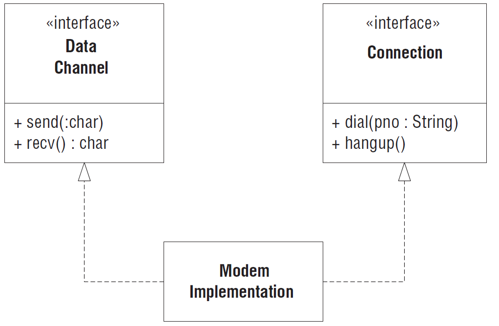

# SOLID - принципы

**SOLID** — мнемонический акроним, введённый Майклом Физерсом для первых пяти принципов, названных Робертом Мартином в начале 2000-х, которые означали 5 основных принципов объектно-ориентированного программирования и проектирования.

**Основные принципы**:

| __Инициалы__ | __Название__                                                                                                       |
|--------------|--------------------------------------------------------------------------------------------------------------------|
| **S**RP      | [Принцип единственной ответственности (Single Responsibility Principle)](#принцип-единственной-ответственности)    |
| **O**CP      | [Принцип открытости/закрытости (Open–closed principle)](#принцип-открытостизакрытости)                             |
| **L**SP      | [Принцип подстановки Барбары Лисков (Liskov substitution principle)](#принцип-подстановки-барбары-лисков)          |
| **I**SP      | [Принцип разделения интерфейсов (Interface segregation principle)](#принцип-разделения-интерфейсов)                |
| **D**IP      | [Принцип инверсии зависимостей (Dependency inversion principle)](#принцип-инверсии-зависимостей)                   |

**Остальные принципы**:

| __Инициалы__ | __Название__                                                                                                                   |
|--------------|--------------------------------------------------------------------------------------------------------------------------------|
| REP          | [Принцип эквивалентности повторного использования и выпуска (...)](#принцип-эквивалентности-повторного-использования-и-выпуска)|
| CCP          | [Принцип общей закрытости (...)](#принцип-общей-закрытости)                                                                    |
| CRP          | [Принцип совместного повторного использования (...)](#принцип-совместного-повторного-использования)                            |
| ADP          | [Принцип ацикличности зависимостей (...)](#принцип-ацикличности-зависимостей)                                                  |
| SDP          | [Принцип устойчивых зависимостей (...)](#принцип-устойчивых-зависимостей)                                                      |
| SAP          | [Принцип устойчивых абстракций (...)](#принцип-устойчивых-абстракций)                                                          |

## Принцип единственной ответственности

Этот принцип впервые был описан в работе Тома ДеМарко и Мейлира Пейдж-Джонса. Они назвали его *сцепленностью* (Cohesion), определив ее как функциональную соотнесенность элементов модуля. В этой главе мы несколько переиначим смысл этого термина и будем понимать под сцепленностью силы, заставляющие модуль или класс изменяться.

---
**Принцип единственной обязанности (Single-Responsibility Principle – SRP)**

У класса должна быть только одна причина для изменения.

---

Рассмотрим игру [в боулинг](https://codingdojo.org/kata/Bowling/). На протяжении почти всей разработки у класса ```Game``` было две различных обязанности: отслеживать текущий фрейм и вычислять счет. В конце концов БМ и БК разнесли эти обязанности по разным классам. Класс ```Game``` сохранил ответственность за отслеживание фреймов, а ответственность за ведение счета перешла к классу ```Scorer```.

Почему так важно было поручить эти обязанности разным классам. Потому, что каждая обязанность – это ось изменения. Любое изменение требований проявляется в изменении распределения обязанностей между классами. Если класс берет на себя несколько обязанностей, то у него появляется несколько причин для изменения.

Если класс отвечает за несколько действий, то его обязанности оказываются связанными. Изменение одной обязанности может привести к тому, что класс перестанет справляться с другими. Такого рода связанность – причина хрупкого дизайна, который неожиданным образом разрушается при изменении.

Если класс отвечает за несколько действий, то его обязанности оказываются связанными. Изменение одной обязанности может привести к тому, что класс перестанет справляться с другими. Такого рода связанность – причина хрупкого дизайна, который неожиданным образом разрушается при изменении.


*Более одной обязанности*

Классом ```Rectangle``` пользуются два разных приложения. Одно относится к области вычислительной геометрии. Класс ```Rectangle``` в нем применяется для математических вычислений с геометрическими фигурами, но на экране оно ничего не рисует. Другое приложение графическое, оно может каким-то боком касаться и вычислительной геометрии, но совершенно точно выводит прямоугольник на экран.

Такой дизайн нарушает принцип SRP. У класса ```Rectangle``` две обязанности: предоставление математической модели прямоугольника и рисование прямоугольника в графическом интерфейсе пользователя (UI).

Нарушение SRP порождает ряд серьезных проблем. Во-первых, мы должны включать ГИП в приложение вычислительной геометрии. В Java придется собирать относящуюся к UI сборку и развертывать ее вместе с приложением вычислительной геометрии.

Во-вторых, если изменение приложения ```GraphicalApplication``` по какой-то причине потребует изменить класс Rectangle, то нам придется заново собирать, тестировать и развертывать приложение ```ComputationalGeometryApplication```. Если мы забудем об этом, то приложение может неожиданно перестать работать.

Более правильный подход к дизайну состоит в том, чтобы распределить обязанности по двум разным классам, как показано на рис. 8.2. Теперь
вычислительная часть ```Rectangle``` помещена в класс ```GeometricRectangle``` и изменения в алгоритме рисования прямоугольников не могут повлиять на приложение ```ComputationalGeometryApplication```.


*Обязанности разделены*

### Определение обязанности

В контексте принципа SRP мы будем называть обязанностью причину изменения. Если вы можете найти несколько причин для изменения класса, то у такого класса более одной обязанности. Иногда увидеть это трудно. Мы привыкли воспринимать обязанности группами. Рассмотрим, например, интерфейс ```Modem``` в листинге 8.1. Многие согласятся, что выглядит он совершенно нормально. Все четыре объявленных метода, несомненно, относятся к модему.

*Modem.java - нарушение SRP*

```java
public interface Modem
{
    void dial(string pno);
    void hangup();
    void send(char c);
    char recv();
}
```

Однако здесь присутствуют две обязанности: управление соединением (методы ```dial``` и ```hangup```) и передача данных (методы ```send``` и ```recv```).

Следует ли разделить эти обязанности? Все зависит от того, как именно изменяется приложение. Если модификация подразумевает изменение сигнатуры методов управления соединением, то дизайн начинает попахивать жесткостью, так как классы, вызывающие ```Send``` и ```Recv```, придется повторно компилировать и развертывать чаще, чем хотелось бы. В таком случае обязанности следует разделить, как показано на рис. 8.3. Это защищает приложение-клиент от связанности двух обязанностей.


*Разделенный интерфейс модема*

С другой стороны, если приложение не модифицируют таким образом, что эти обязанности изменяются порознь, то и разделять их нет необходимости. Более того, разделение в этом случае попахивало бы ненужной сложностью.

Отсюда вытекает следствие. *Ось изменения становится таковой, только если изменение имеет место*. Неразумно применять SRP – как и любой другой принцип, – если для того нет причин.

### Разделение связанных обязанностей

Обратите внимание, что на рис. 8.3 обе обязанности связаны в классе ```ModemImplementation```. Это нежелательно, но может оказаться необходимым.
Часто имеются причины, обычно относящиеся к деталям оборудования или операционной системы, которые вынуждают нас связывать такие вещи, которые связывать не хотелось бы. Но, разделив интерфейсы, мы развели эти концепции с точки зрения приложения.

Класс ModemImplementation можно считать вынужденным клуджем (англ. [kludge](https://ru.wiktionary.org/wiki/kludge)); однако отметим, что все зависимости ведут от него. Ничто не обязано зависеть от этого класса. Ничто, кроме метода Main, не обязано знать о его существовании. Таким образом, мы поместили этого уродца за ограду. Его яд не проникнет наружу и не отравит остальное приложение.

### Обеспечение сохранности

На рис. 8.4 показано распространенное нарушение принципа SRP. Класс ```Employee``` содержит как бизнес-правила, так и механизмы управления сохранением. Эти обязанности почти никогда не следует смешивать. Бизнес-правила имеют тенденцию часто изменяться, а механизмы сохранения изменяются реже и совершенно по другим причинам. Связывать бизнес-правила с подсистемой сохранения – значит напрашиваться на неприятности.


*Связанный механизм сохранения*

К счастью, как мы видели в главе 4, методика разработки через тестирование обычно вынуждает разделять эти обязанности задолго до того, как в дизайне появляется душок. Однако если тесты не заставили это сделать, а аромат жесткости и хрупкости ощущается все сильнее, то дизайн следует подвергнуть рефакторингу, применяя для разделения обязанностей паттерны Фасад, DAO (Data Access Object – Объект доступа к данным) или Заместитель (Proxy).

### Выводы

Принцип единственной обязанности – один из самых простых, но при этом его трудно применять правильно. Сочетание обязанностей для нас выглядит совершенно естественно. Их выявление и разделение как раз и является одной из задач проектирования ПО. Мы еще будем неоднократно возвращаться к этой теме при обсуждении остальных принципов.

## Принцип открытости/закрытости

//TBD

## Принцип подстановки Барбары Лисков

//TBD

## Принцип разделения интерфейсов

//TBD

## Принцип инверсии зависимостей

//TBD

## Принцип эквивалентности повторного использования и выпуска

//TBD

## Принцип общей закрытости

//TBD

## Принцип совместного повторного использования

//TBD

## Принцип ацикличности зависимостей

//TBD

## Принцип устойчивых зависимостей

//TBD

## Принцип устойчивых абстракций

//TBD
