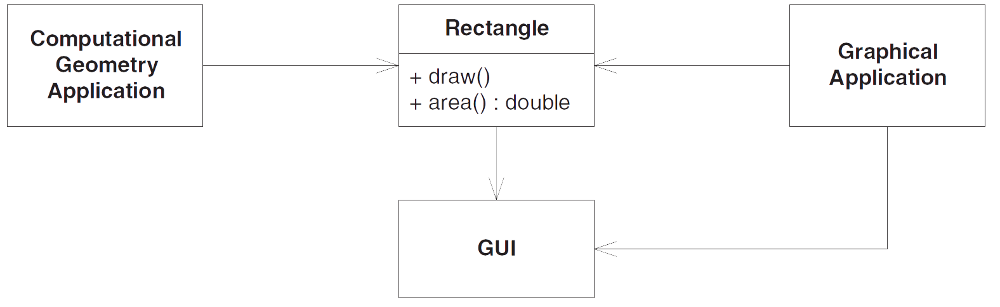
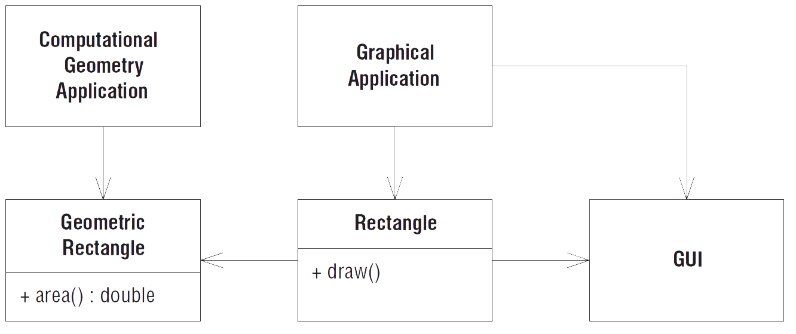

# Принцип единственной ответственности (SRP)

Оригинальный текст из книги Робертом Мартина [Agile Principles, Patterns, and Practices](https://www.amazon.com/Agile-Principles-Patterns-Practices-C/dp/0131857258).

Этот принцип впервые был описан в работах [Тома ДеМарко](https://www.amazon.com/Structured-Analysis-System-Specification-DeMarco/dp/0138543801) и [Мейлира Пейдж-Джонса](https://www.amazon.com/Practical-Guide-Structured-Systems-Design/dp/0136907695/). Они назвали его *сцепленностью* (cohesion), определив ее как функциональную связанность элементов модуля. Далее мы будем понимать под сцепленностью силы, заставляющие модуль или класс изменяться. Один из группы принципов [SOLID](SOLID.md).

---
**Принцип единственной ответственности (Single-Responsibility Principle – SRP).**

*У класса должна быть только одна причина для изменения.*

---

Почему так важно было разделять разные обязанности между разным классами? Потому, что каждая обязанность – это ось изменения. Любое изменение требований проявляется в изменении распределения обязанностей между классами. Если класс берет на себя несколько обязанностей, то у него появляется несколько причин для изменения.

Если класс отвечает за несколько действий, то его обязанности оказываются связанными. Изменение одной обязанности может привести к тому, что класс перестанет справляться с другими. Такого рода связанность – причина хрупкого дизайна, который неожиданным образом разрушается при изменении.

Если класс отвечает за несколько действий, то его обязанности оказываются связанными. Изменение одной обязанности может привести к тому, что класс перестанет справляться с другими. Такого рода связанность – причина хрупкого дизайна, который неожиданным образом разрушается при изменении.

Рассмотрим пример. У класса ```Rectangle``` есть два метода. Один рисует прямоугольник на экране, другой вычисляет площадь прямоугольника.



*Более одной обязанности*

Классом ```Rectangle``` пользуются два разных приложения. Одно относится к области вычислительной геометрии. Класс ```Rectangle``` в нем применяется для математических вычислений с геометрическими фигурами, но на экране оно ничего не рисует. Другое приложение графическое, оно может каким-то образом касаться и вычислительной геометрии, но совершенно точно выводит прямоугольник на экран.

Такой дизайн нарушает принцип SRP. У класса ```Rectangle``` две обязанности: предоставление математической модели прямоугольника и рисование прямоугольника в графическом интерфейсе пользователя (UI).

Нарушение SRP порождает ряд серьезных проблем. Во-первых, мы должны включать UI в приложение вычислительной геометрии. В Java придется собирать относящуюся к UI часть системы и развёртывать её вместе с приложением вычислительной геометрии.

Во-вторых, если изменение приложения ```GraphicalApplication``` по какой-то причине потребует изменить класс ```Rectangle```, то нам придется заново собирать, тестировать и развертывать приложение ```ComputationalGeometryApplication```. Если мы забудем об этом, то приложение может неожиданно перестать работать.

Более правильный подход к дизайну состоит в том, чтобы распределить обязанности по двум разным классам. Теперь
вычислительная часть ```Rectangle``` помещена в класс ```GeometricRectangle``` и изменения в алгоритме рисования прямоугольников не могут повлиять на приложение ```ComputationalGeometryApplication```.



*Обязанности разделены*

К счастью, подход [разработки через тестирование (TDD)](TDD.md) обычно вынуждает разделять эти обязанности задолго до того, как в дизайне появляется "душок". Однако если тесты не заставили это сделать, а аромат "жесткости" и "хрупкости" ощущается всё сильнее, то дизайн следует подвергнуть [рефакторингу](Refactoring.md), применяя для разделения обязанностей паттерны Фасад, DAO (Data Access Object – Объект доступа к данным) или Заместитель (Proxy).

Принцип единственной ответственности – один из самых простых, но при этом его трудно применять правильно. Сочетание обязанностей для нас выглядит совершенно естественно. Их выявление и разделение как раз и является одной из задач проектирования ПО. Мы еще будем неоднократно возвращаться к этой теме при обсуждении остальных принципов.

Адаптировал: [Кротов Артём](https://github.com/timmson).

Остались вопросы? Задавай в [нашем чате](https://t.me/technicalexcellenceru).
