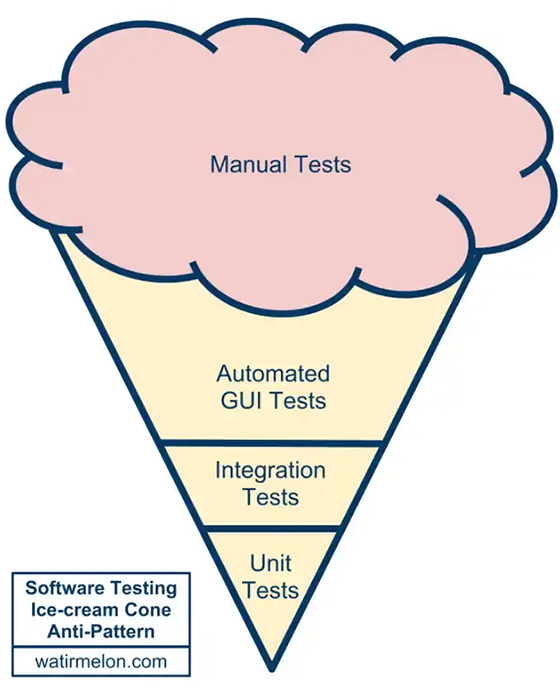

# Пирамида тестирования (Test Pyramid)

Перевод статьи на русский язык Мартина Фаулера [Test Pyramid](https://martinfowler.com/bliki/TestPyramid.html)

Тестовая пирамида (Test pyramid) - способ использования тестов разного вида для создания сбалансированного портфолио. Ключевая особенность в том, что у вас должно быть больше низкоуровневых [модульных (unit-) тестов](UnitTest.md), чем высокоуровневых ([BroadStackTest](BroadStackTest.md)), которые вызывают приложение через GUI.

На протяжении большей части моей карьеры под автотестами понимались тесты, которые обращались к приложению через пользовательский интерфейс. Такие инструменты часто предоставляли возможность записывать взаимодействие пользователя и приложения в виде сценариев, запускать их проверяя, что приложение ведёт себя корректно. Изначально такой подход работал хорошо. Потому что записывать сценарии довольно легко, и заниматься этим могут люди без навыков программирования.

Но этот подход быстро стал источником проблем, став "рожком с мороженым"[1](#footnote-1). Тестирование через пользовательский интерфейс довольно медленное, и в целом увеличивает время разработки. Часто оно требует лицензии на специальное ПО для автоматизации тестирования, что означает, что такое ПО может быть использовано только на индивидуальном рабочем месте. Обычно это ПО не может запущенно в консольном режиме, и не может быть корректно помещено в [deployment pipeline](DeploymentPipeline.md).

Самое главное, что такие тесты очень хрупкие. Дальнейшая разработка системы может легко привести к тому, что многие такие сценарии сломаются, и их придется заново записывать. Вы можете обойти эту проблему, отказавшись от инструментов записи и воспроизведения, но это усложняет написание тестов[2](#footnote-2). Даже при использовании хороших практик при написании таких тестов они более подвержены [недетерминированным](https://martinfowler.com/articles/nonDeterminism.html) проблемам, что может подорвать доверие к ним. Короче говоря, тесты, которые проходят через пользовательский интерфейс, являются хрупкими, дорогостоящими в написании и длительными по времени для выполнения. Таким образом, пирамида утверждает, что вам следует проводить гораздо больше автоматизированного тестирования с помощью модульных тестов, чем с помощью традиционного тестирования на основе графического интерфейса[3](#footnote-3).

Пирамида также постулирует промежуточный уровень тестов, которые взаимодействуют с приложением через его сервисный слой. Я называю их ["подкожными"](SubcutaneousTest.md) тестами. Они обладают многими преимуществами [e2e-тестов](End2EndTest.md), но позволяют избежать многих сложностей, связанных с пользовательским интерфейсом. В веб-приложениях это будет соответствовать тестированию через API-слой, тогда как верхняя часть пирамиды пользовательского интерфейса будет соответствовать тестам, использующим такие инструменты, как [Selenium](https://www.selenium.dev/) или Sahi.

Пирамида тестирования часто встречается в обсуждениях Agile-тестирования, и, хотя если её основная идея довольно ясна, то о том как создавать сбалансированный портфель всё ещё много что можно сказать. Распространенная проблема заключается в том, что команды смешивают концепции [e2e-тестов](End2EndTest.md), тестов пользовательского интерфейса и тестов, ориентированных на клиента. Все это ортогональные характеристики. Например, поведение пользовательского интерфейса, основанное на JavaScript, должно быть в основном протестировано с помощью модульных тестов на Javascript с использованием чего-то вроде [Jasmine](https://jasmine.github.io/). Сложный набор бизнес-правил может иметь тесты, написанные на языке пользователя, но запускаться только в соответствующем модуле, как и модульные тесты.

Я всегда утверждаю, что тесты высокого уровня служат только второй линией защиты. Если вы получаете сбой в высокоуровневом тесте, это означает, что у вас есть не только ошибка в коде, но и отсутствующий или неправильный модульный тест. Поэтому я советую перед исправлением ошибки, обнаруженной с помощью высокоуровневого теста, воспроизвести ошибку с помощью модульного теста. Далее модульный тест будет гарантировать[4](#footnote-4), что ошибка больше не воскреснет.

## Заметки

1.  Перевёрнутая пирамида тестирования, когда нет других тестов кроме пользовательских (прим. переводчиков).

2.  Инструменты записи и воспроизведения почти всегда являются плохой идеей для любого вида автоматизации, поскольку они
   сопротивляются любым изменениям и препятствуют использованию полезных абстракций. Их стоит использовать только в качестве инструмента для генерации
   фрагментов сценариев, которые вы затем можете редактировать, как настоящий программный код, как в
   почтенном [Emacs](http://www.gnu.org/software/emacs/manual/html_node/emacs/Save-Keyboard-Macro.html).

3.  Пирамида основана на предположении, что верхнеуровневые тесты медленны и хрупки по сравнению с более сфокусированными
   тестами, такими как модульные тесты. Хотя обычно это так, но есть исключения. Если тесты высокого уровня быстры, надежны и дешевы в изменении, то
   тесты более низкого уровня попросту не нужны.

4.  Не все сценарии требуют проверки с помощью модульных тестов, некоторые из них имеет смысл оставить на уровне e2e-тестов (
   прим. переводчиков).

Перевели: [Кротов Артём](https://github.com/timmson) и [Сергей Лобин](https://fb.com/2heoh).

Остались вопросы? Задавай в [нашем чате](https://t.me/technicalexcellenceru).
